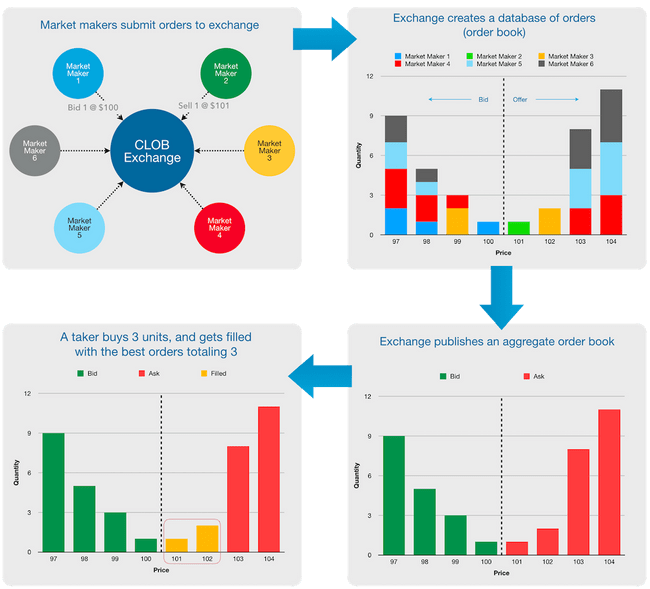
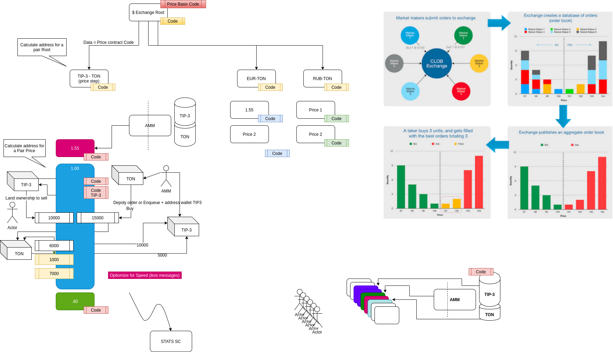

<p align="center"></p> 
<h1 align="center">Flash Exchange (FLEX)</h1>

Flex is a [FreeTon](https://freeton.org/discover) decentralized and distributed limit order book (DLOB) which takes a most common centralized exchange model: central limit order book (CLOB) and implements it on-chain via distributed smart contract model. 


## Flex DeBot 
 [`FlexDebot`](https://github.com/tonlabs/flex/blob/main/debots/flexDebot/flexDebot.sol) -[DeBot](https://help.ton.surf/en/support/solutions/articles/77000397693-what-are-debots-) that helps buy/sell TIP3 tokens: 
 - queue all available pairs
- queue all price contracts in the pair and display current sell/buy order quantity
- show current book price
- create and send **Good-til-cancelled (GTC) order** for a selected token quantity for a selected Price
Since this will require to have a token wallet and to transfer the ownership of the user wallet to the Price Contract it should do all this just by asking user for a seed phrase or private key once
- display active user orders
- withdraw active user orders

DeBot is deployed to [net.ton.dev](https://net.ton.live). Run it with tonos-cli or enter debot address in [Surf](https://ton.surf/main):
```
tonos-cli --url net.ton.dev debot fetch 0:47abef2c28f6db37ecb3aec7c9e78a48333f131fef46c9b831f153d34df5e25c
```
```
tonos-cli --url rustnet.ton.dev debot fetch 0:65e895d0deb7cd84ead4708956c979388210c8aeb5a1761bacbc7b51c856b53d
```
*please note that the current implementation is an MVP and is generally a **work in progress — You should not use it for real trading!!!**


## TIP3 DeBot

[`tip3Debot`](https://github.com/tonlabs/flex/blob/main/debots/tip3Debot/tip3Debot.sol) - [DeBot](https://help.ton.surf/en/support/solutions/articles/77000397693-what-are-debots-) that helps manage TIP3 tokens: 
- create new TIP3 token, 
- grant TIP3 tokens to TIP3 wallets.

DeBot is deployed to [net.ton.dev](https://net.ton.live). Run it with tonos-cli or enter debot address in [Surf](https://ton.surf/main):

```
tonos-cli --url net.ton.dev debot fetch 0:5e11dd18cf73aaf386ac1ebec2c78ea1fd91969e8e1d4a7bcff1eca38c4f0445
```
```
tonos-cli --url rustnet.ton.dev debot fetch 0:186b5095ccbecdcaeead39b25923d233d52df498a07e01cdf0b1141b80dd0251
```
*please note that the current implementation is an MVP and is generally a **work in progress — You should not use it for real trading!!!**

## AMM Flex DeBot
```
tonos-cli --url net.ton.dev debot fetch 0:807f0363a8192c9f18b8f6709ed37b50192b0f94d3f1aeacd577f6b253cbbed1
```
```
tonos-cli --url rustnet.ton.dev debot fetch 0:4ac01ac5f2d71e5e684eaa5ccf44d9eab19c71d0438280a66e087f1b3e9bb5e2
```

###Prerequisites: 

You can run debots in (Surf)[https://ton.surf/main] or latest (tonos-cli)[https://github.com/tonlabs/tonos-cli/].  install:
```
tondev tonos-cli install
```

#### TL;TR

Compile all DeBots using [`tondev`](https://github.com/tonlabs/tondev) tool:

```bash
tondev sol compile <debotName>.sol
```

This is Flex:


*(we thank [@eternalflow](https://github.com/eternalflow) for a picture of his dog!)*

## What Problem Are We Trying to Solve?

The biggest problem with decentralized exchanges is its speed of execution, lack of advanced trading strategies ability and complex management. Here we propose a decentralized trading engine and order book with low latency and guaranteed trade execution. It is flexible — allowing extendable strategies, extremely fast — providing immediate execution and settlement of an order and both decentralized and distributed. This allows Flex to perform at par with Free TON blockchain performance. For example an average execution across 128 threads will by 0.08 seconds at roughly 80,000 trading pairs messages per second throughput for one shardchain. It will take just 15 workchains to beat Binance performance and 150 workchains to compete with BATS exchange. Usage of DeBots make it super easy to add simple or advanced user interfaces.

Flex is a decentralized and distributed limit order book (DLOB) which takes a most common centralized exchange model: central limit order book (CLOB) and implements it on-chain via distributed smart contract model. Many have tried this approach before and failed (EtherDelta, DDEX, Radar Relay, etc.). Up until now the problem of creating an order book on chain were: the slow speed of execution and the possibility of front-running orders. Some are trying to solve this by moving to the fastest possible blockchain. But just having a fast blockchain is not enough because usually order books are pretty large and complex which takes time to operate on. Flex distributed atomic contracts solves this problem distributing the load on the order book down to single price of a single pair.

A central exchanges using CLOB such as NYSE, CBOT, Coinbase, Binance operates in a microsecond time frames.

That is how it looks:



## How orders are filled on CLOB?

The most common algorithm used is Price/Time priority, aka FIFO: all orders at the same price level are filled according to time priority; the first order at a price level is the first order matched.

Up until now there was a problem implementing this algorithm on a blockchain because transactions are usually prioritized by miners based on the gas fee they pay, allowing for front running the Time priority. Free TON does not have these problems.

### CLOB are hard to implement on a blockchain because:

The size of the state needed by an order book to represent the set of outstanding orders (e.g., passive liquidity) is large and extremely costly in the smart contract environment, where users must pay for space and compute power utilized.

[G. Wood et al., “Ethereum: A secure decentralised generalised transaction ledger,”
Ethereum project yellow paper, vol. 151, no. 2014, pp. 1–32, 2014.]

The matching logic for order books is often complicated as it must often support
several different order types (such as icebergs, good-till-cancel, and stop-limit orders

[M. Wyart, J.-P. Bouchaud, J. Kockelkoren, M. Potters, and M. Vettorazzo, “Relation
between bid–ask spread, impact and volatility in order-driven markets,” Quantitative
Finance, vol. 8, no. 1, pp. 41–57, 2008]

## How does FLEX solve this

Flex achieves load balancing and speed of execution by distributing the logic among many atomic smart contracts, while simultaneously transfering search and decision logic to user computers. All Order Book contracts addresses are deterministically calculated: the Trading Pair and its Price order contracts.

For instance TON- XTIP3 will resolve a Root of TON-XTIP3 trading pair. User then can calculate an address of a particular Price Contract by entering a Price. Code Hash=$TON-TIP3 Data=1.2 will calculate an address of a contract that currently trades a TON-TIP3 pair at 1.2 TON per 1 TIP3 token.

After performing the calculation of addresses user performs read operation: querying blockchain database with SDK over GraphQL. Since each user only calculates pairs and prices it needs the operation takes microsenconds and one query is almost instantaneous.

Let’s agree that a trading step should not be more than 0.01 (this information will be provided in the pair Root Contract data). User can now calculate a whole order book of this pair by entering all price steps around the target price or ask database for all addresses of that Price contract code hash. After calculating all price step contract addresses a user may try to retrieve all these contracts. If the contract does not exist means there are no orders of that price.


In order to execute a trade user can choose several strategies:
If the price contract does not exist, a User can create a "Good-til-cancelled (GTC) order" by deploying the $asset pair contract adding the Price as a contract data in the constructor and sending the required amount of money to cover the trade. For example passing a price of $0.55 TIP3 into constructor and sending 10,000 TONs to the contract will create a sell order of 10,000 TONs for $0.55 TIP3 per 1 TON in $TIP3-TON trading pair contract. Sending TIP3 tokens will create a buy order.

All matched orders in the contract are executed immediately. If the contract does not have any orders it will terminate itself, this is important as the existence of the Price Contract at the calculated address by itself means orders of that price exist. Therefore just by retrieving all deployed contracts by a contract code hash, a user can see a whole stack of the order book.

If an order "Good till cancelled" can not be executed in one transaction it should execute itself in several sending each time a message to itself.

**Cancel order** — a User can Cancel un-executed orders at any time.

Many strategies are possible but are not yet implemented:
If the contract for the order price exists the user can send a message with **Immediate or cancel (IOC)** order which will be executed immediately even partially or canceled if the trade can not be performed.

**Fill or kill (FOK)** will cancel the order if a full order amount is not available.

**Good-til-cancelled (GTC)** can be created in which case the order will stay in the contract until it is fulfilled by a counterparty (if any).

User can discover price and perform some conditional strategies either on a client side or by a smart contract, emulating a high frequency trading:

**A price**

User client can retrieve all messages for a trading pair contract and sort them by time to find the latest trades of that pair. Successful trade transactions should emit a message so it could be found later.

Instead of a client software an automatic execution could be programmed with a **paid subscription method** of an $Asset contract. The contract may send a message to other contracts that are subscribed to it once any trade is executed. Such service is payable by contracts subscribed to it to the owner of the Order payable upon Contract termination. The subscribed contract can then perform automatic strategies based on this information, connect Automated Market Maker smart contracts or Liquidity Pools.

The following order types will be added shortly:

**A market order** could be filled if User client software will search for latest transactions in the pair contracts to sell 10,000 TONs. When finding a deployed contract with best price starting from the latest executed user client software can retrieve the offered amount and send the Currency to this contract. Sending TONs to such contract will immediately execute the trade with the contract asset price for the sent amount.

**A limit order** is an order to buy or sell a security at a specific price or better. A buy limit order can only be executed at the limit price or lower, and a sell limit order can only be executed at the limit price or higher. Example: A user could submit a limit order for a specific amount and this order will only execute if the price of ABC stock is at that price or lower.

## Tip3 wallets workflow

To sell tip3 tokens, client should call new tip3 method `lendOwnership` with dest=<Price address> and payload=<params for sellTip3>. Tip3 wallet sends notification about provided ownership with its current balance, lend finish time and the payload.

Price will check sender address to be a correct tip3 wallet address. If checks succeeded, Price will process or enqueue this sell.
Tip3 ownership is provided with finish time, when ownership will return back to the original owner (in case of error in service).

To buy tip3 tokens, client should specify tip3 wallet in his ownership by address in `buyTip3` arguments.



## Implementation

```cpp
struct OrderRet {
  uint32 err_code;
  uint128 processed;
  uint128 enqueued;
};

struct SellArgs {
  uint128 amount;
  addr_std_fixed receive_wallet;
};

__interface IPrice {
  // payload must be SellArgs struct
  [[internal, noaccept, answer_id]]
  OrderRet onTip3LendOwnership(
    uint128 balance, uint32 lend_finish_time, uint256 pubkey, uint256 internal_owner,
    cell payload, address answer_addr) = 201;

  [[internal, noaccept, answer_id]]
  OrderRet buyTip3(uint128 amount, address receive_tip3, uint32 order_finish_time) = 202;

  // will be called in case of deals limit hit in buy/sell processing
   [[internal, noaccept]]
  void processQueue() = 203;

  // will cancel all orders with this sender's receive_wallet
  [[internal, noaccept]]
  void cancelSell() = 204;

  // will cancel all orders with this sender's answer_addr
  [[internal, noaccept]]
  void cancelBuy() = 205;
};

// callback for client notification
__interface IPriceCallback {
  [[internal, noaccept]]
  void onOrderFinished(OrderRet ret, bool_t sell);
};

__interface IFLeX {

  [[external, dyn_chain_parse]]
  void constructor(uint256 deployer_pubkey,
    uint128 transfer_tip3, uint128 return_ownership, uint128 trading_pair_deploy,
    uint128 order_answer, uint128 process_queue, uint128 send_notify,
    uint128 min_amount, uint8 deals_limit, address notify_addr);

  // To fit message size limit, setPairCode/setPriceCode in separate functions
  //  (not in constructor)
  [[external, noaccept]]
  void setPairCode(cell code);

  [[external, noaccept]]
  void setXchgPairCode(cell code);

  [[external, noaccept]]
  void setPriceCode(cell code);

  [[external, noaccept]]
  void setXchgPriceCode(cell code);

  // ========== getters ==========

  // means setPairCode/setPriceCode executed
  [[getter]]
  bool_t isFullyInitialized();

  [[getter]]
  TonsConfig getTonsCfg();

  // Stock address will be added to Pair code as a salt
  [[getter]]
  cell getTradingPairCode();

  // Stock address and tip3 root address will be added to Price code as a salt
  [[getter, dyn_chain_parse]]
  cell getSellPriceCode(address tip3_addr);

  // Calculate address of trading pair contract for this tip3 root address
  [[getter, dyn_chain_parse]]
  address getSellTradingPair(address tip3_root);

  // Minimum amount to trade
  [[getter]]
  uint128 getMinAmount();

  // Deals limit to be processed in one message processing
  [[getter]]
  uint8 getDealsLimit();

  // Notification address (for AMM service)
  [[getter]]
  address getNotifyAddr();
};
```

## TIP3 to TIP3 exchange 

https://github.com/tonlabs/flex/blob/main/PriceXchg.hpp
https://github.com/tonlabs/flex/blob/main/XchgPair.hpp

#### STEP3 implementation
- Multiple orders automation 

- More strategies


