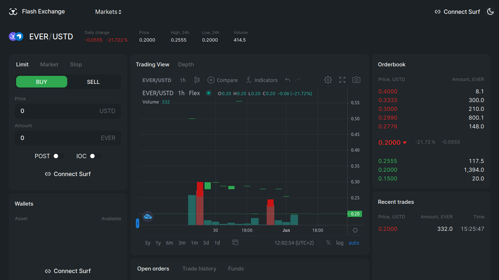
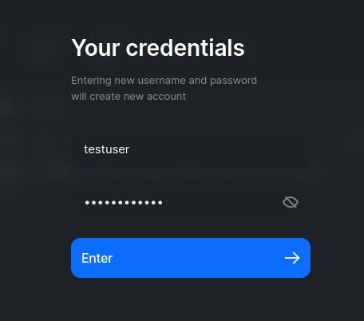
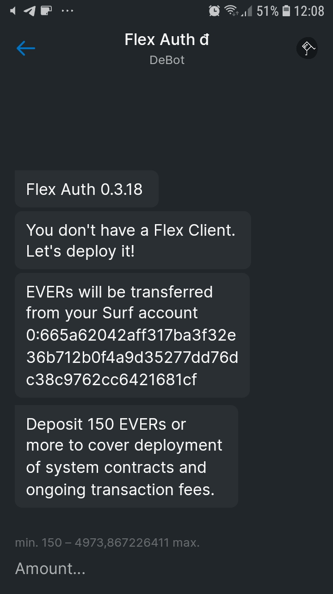
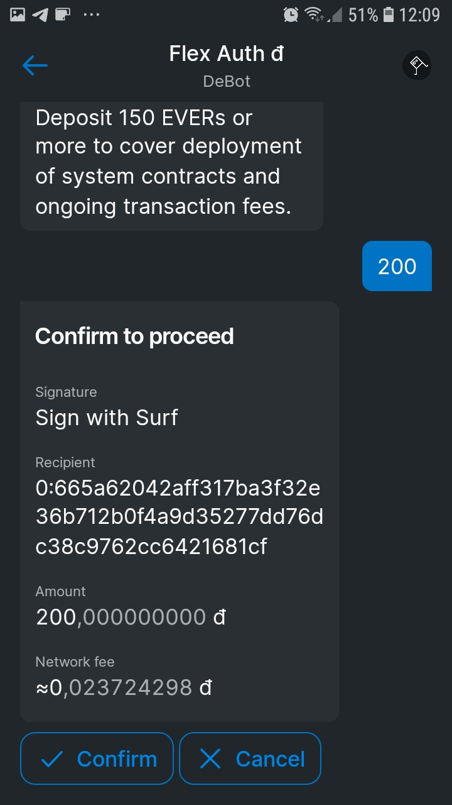
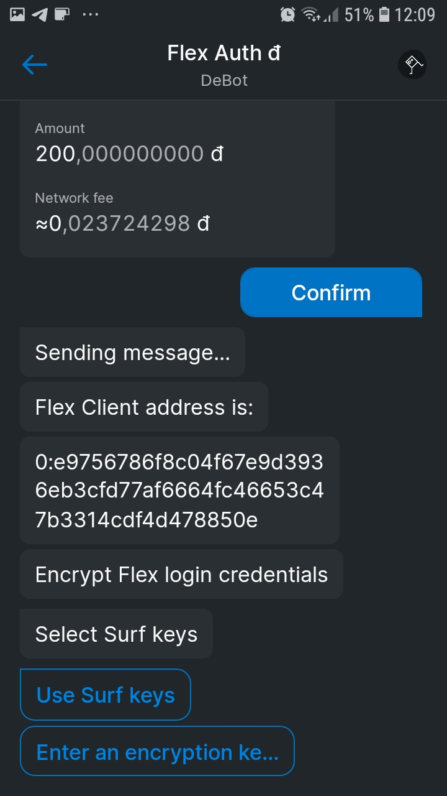
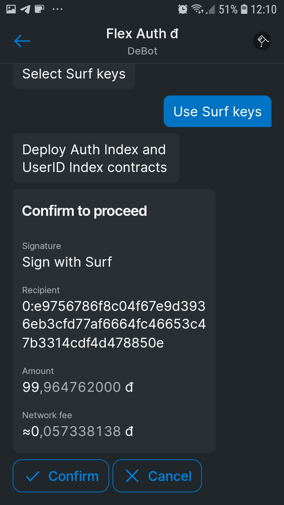
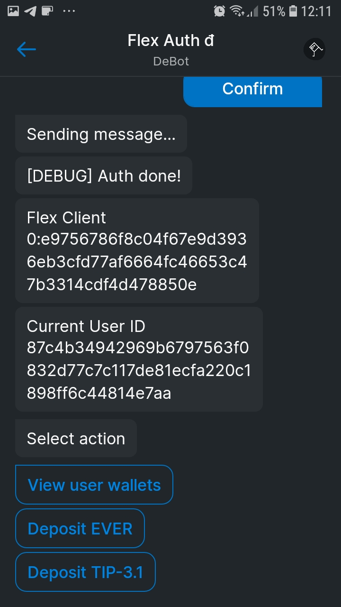
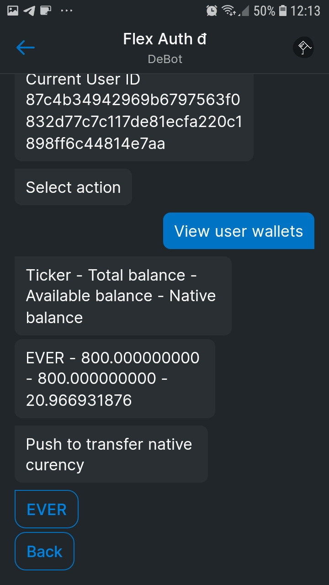

# Connect Your Wallet

To get started trading on Flex you need to have a Surf wallet with your tokens. Follow this guide to get authorized in Flex by connecting your wallet.

Open Flex and click **Connect Surf**.

The authorization prompt will appear. Enter a username and password for your Flex account.

Flex will generate a link to open the **Auth DeBot** in Surf. Scan The **QR code** with your mobile device or click **Open Desktop app** button.

The **Auth DeBot** will launch and check if you already authorized this Flex account. If not, the authorization will start from the very beginning by deploying your Flex Client smart contract. It is going to govern all your assets on Flex and it is in turn controlled  only by your Surf wallet.

Enter an amount of tokens to send to Flex for initial deployment and ongoing transaction fees. This will be your **Gas** balance.


Since Flex works entirely on-chain, all actions and all smart contracts, such as your Flex wallets, require native EVERs to cover blockchain fees. Your Gas balance will be gradually spent on these fees.


The recommended amount depends on how many token pairs you expect to trade in. About 200 EVERs is a good starting amount for trading in one token pair. Increase it by \~30 EVERs with every additional kind of token you plan to trade on Flex.

You will always be able to top up your Gas balance.

After entering the amount, confirm the transaction with Surf.

The DeBot will deploy your Flex Client contract and display its address. Then it will ask you what keys to use to encrypt your Flex credentials. In most cases, use Surf keys.

Confirm the resulting transaction. The necessary Flex smart contracts will be deployed.

After deployment, the DeBot will display your User ID. It identifies the specific instance of Flex you are authorizing and can later be used to manage it.

At this point you have completed authorization authorized, but have no funds on Flex yet. To deposit funds to Flex, select **Deposit EVER** or **Deposit TIP-3.1**.

Enter amount to deposit for trading.

Enter amount of EVERs to send to your Flex wallet to cover transaction fees. 1 EVER is enough, anything above that will be sent to the Flex wallet individual Gas balance, which will be from now on topped up as required from your main Gas balance.&#x20;

Confirm the transaction.

Once done, you can **View user wallets** to see how many tokens (tradeable and native/gas) are on your deployed Flex wallets.

Looking at your Flex interface you will see the deposited trading funds in your Wallets list.

Currently available Gas balance is displayed in this list toщ. It will gradually be spent on all your actions on Flex. Make sure to [keep it above 50 tokens](keep-up-gas-balance.md) to be able to trade anything on Flex.
