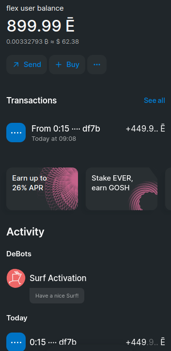

# Get EVERs

Currently Flex works with a [Surf](https://ever.surf/) wallet. Get it for a device of your choice and [activate](https://help.ever.surf/en/support/solutions/articles/77000508953-how-to-activate-your-profile-in-surf-) your account.

Then get some EVERs on your Surf:

* you can [buy](https://help.ever.surf/en/support/solutions/articles/77000513727-how-do-i-top-up-my-surf-wallet-balance-using-a-bank-payment-card-) some in Surf directly
* you can use the [bridge](https://octusbridge.io/) to transfer coins from some other network to Everscale, and then send the coins you transferred to Surf
* you can participate on some community contests or airdrops


Optionally, you can also accumulate some [TIP3](https://help.ever.surf/en/support/solutions/articles/77000525744-tip3-tokens-in-surf) tokens on your Surf account. If they are listed on Flex, you will be able to deposit and trade them.


Once you have some EVERs (overview of the costs of using FLEX can be found [here](../flex-fees.md)) on your **main Surf balance**, you are ready to [connect your wallet](connect-your-wallet.md):

<figure><figcaption></figcaption></figure>
