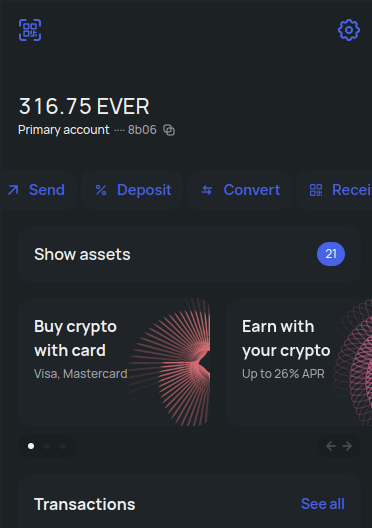

# Get EVERs and Prepare Wallet

Currently Flex works with a [Surf](https://ever.surf/) wallet and uses EVERs to pay fees.&#x20;

To get started, install Surf for a device of your choice ([desktop](https://help.ever.surf/en/support/solutions/articles/77000520542-how-to-install-ever-surf-for-desktop) and [Chrome browser extension](https://chrome.google.com/webstore/detail/ever-surf-keeper/dfldeefnhahdhaolbkhehhlcgagefgff) are also available) and [activate](https://help.ever.surf/en/support/solutions/articles/77000508953-how-to-activate-your-profile-in-surf-) your account.

Then get some EVERs on your Surf:

* you can [buy](https://help.ever.surf/en/support/solutions/articles/77000513727-how-do-i-top-up-my-surf-wallet-balance-using-a-bank-payment-card-) some in Surf directly
* you can buy EVERs on exchanges where it is listed and withdraw to your Surf account



* you can use the [bridge](https://octusbridge.io/) to transfer coins from some other network to your Surf account on Everscale. You will be able to [swap some of them to EVERs during transfer](https://docs.octusbridge.io/use/bridge/cross-chain-transfer/how-to/transferring-from-another-network-to-everscale#select-token-and-amount)


With bridge, you can also get other tokens (WBTC, WETH, USDT, etc.) to your Surf account. If they are listed on Flex, you will be able to deposit and trade them.


Once you have all the tokens you need (overview of the costs of using FLEX can be found [here](../specifications/flex-fees.md)) on your **Surf balance**, you are ready to connect your wallet.

* To use the **Web DApp**, install [Surf Keeper browser extension](https://chrome.google.com/webstore/detail/ever-surf-keeper/dfldeefnhahdhaolbkhehhlcgagefgff). It is currently available for Chrome and Chromium browsers. Then proceed to [connect your wallet ](web-dapp/connect-your-wallet.md)to Web Flex.
* To use the **Desktop DApp,** get ready your desktop or mobile Surf and follow the guide to [connect your wallet](desktop-dapp/connect-your-wallet.md) to the Flex DApp.

<figure><figcaption></figcaption></figure>
