# How to trade on Flex

## What is Flex?

Flex (stands for Flash exchange) is a decentralized exchange on Everscale, which allows users to buy and sell TIP3 distributed tokens listed on it.

Flex operates as a system of open sourced smart contracts, optimized for speed and security. All buy and sell actions are performed through a specialized Flex [DeBot](https://help.ton.surf/en/support/solutions/folders/77000278262), which is supported by DeBot browsers such as [Surf](https://ton.surf/main). It helps the user create and manage all contracts required to trade on Flex.

Flex, Flex DeBot and distributed token source code is available [here](https://github.com/tonlabs/flex).

## What can I trade?

You can buy any listed tokens, or sell any listed tokens you own.

Use the drop-down Markets to select a token you want to trade:

You will be able to deposit your EVERs into Flex to start trading any other tokens listed there.

## How to get started

To trade on Flex you need to authorize your Flex app in [Surf](https://ever.surf).

Click **Connect Surf**.

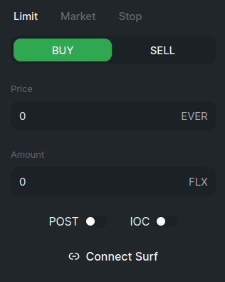

Create your account - enter a username and password for Flex:

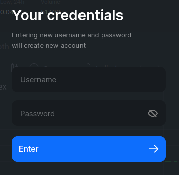

Scan QR code with your Surf or go to Surf web:

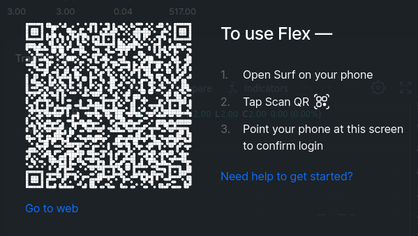

Surf will load the **Flex Auth** DeBot. It will help you set up all you need to trade on Flex.

First, choose how many EVERs you want to deposit to your Client contract for trade operations.

**Note**: These are not the tokens you will trade, these will be used to cover various trading expenses. Don’t send all your tokens here.

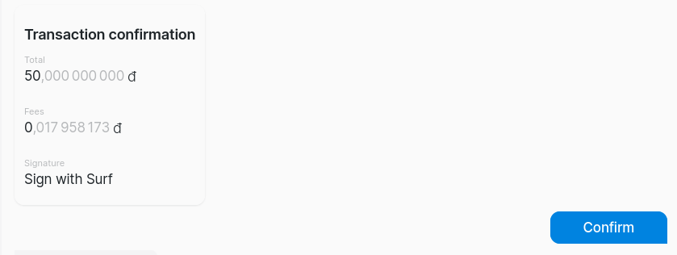

Confirm both suggested transactions, and your Client contract will be deployed.

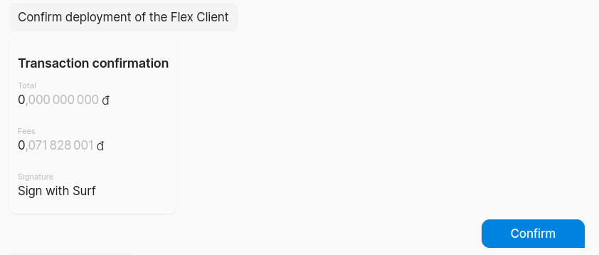

Once it is deployed, your Client contract needs to be configured.

.png>)

Review and confirm the transactions the DeBot suggests.

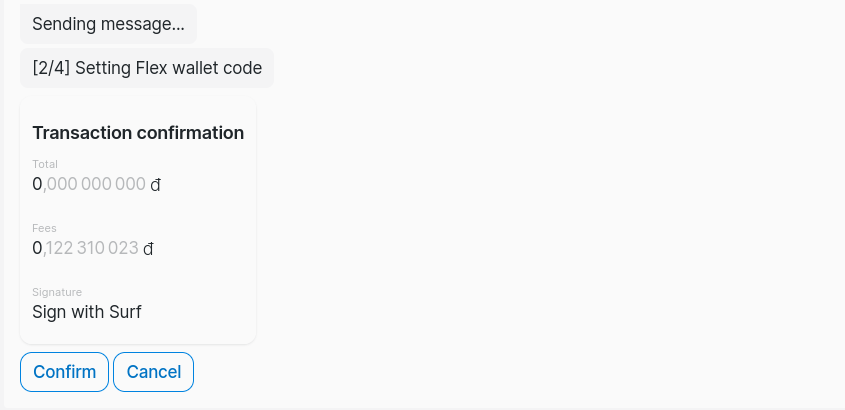

There will be a few of them.

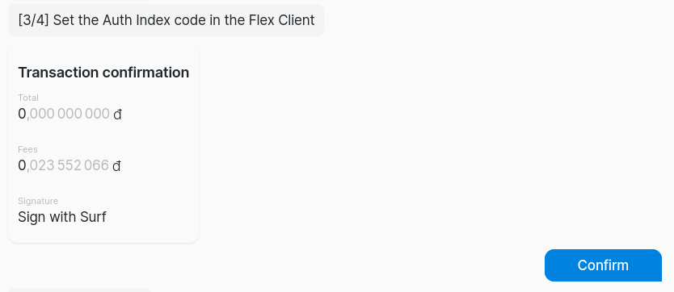

.png>)

Once Client is configured, select what keys to use to encrypt your Flex account credentials.

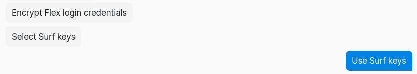

A few more steps to set up contracts required for Flex operations will be deployed. Confirm the required transactions:

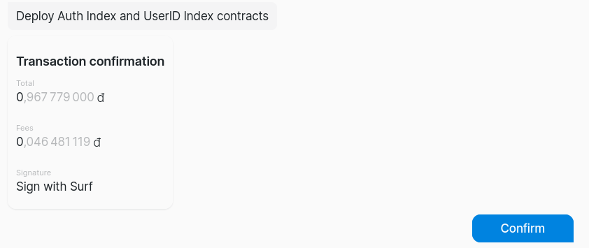

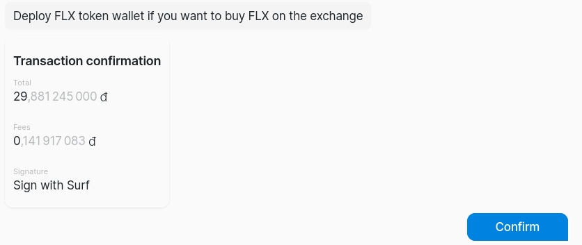

Once all technical transactions are completed, the DeBot will inform you that authorization is done and display your Flex Client address and user ID.

Now you can deposit the EVERs you will trade.

Choose the **Deposit EVER** action, and select how many EVERs you will **transfer to the native balance** (to cover transaction fees, not trade) and how many you want to make available to **trade on Flex**:

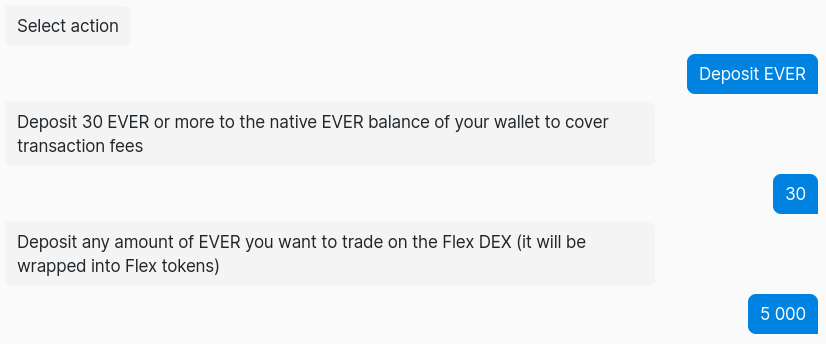

Confirm the transaction for EVERs deposit, and one more transaction for wallet configuration:

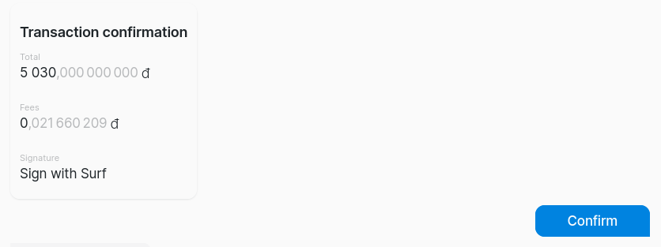

Once this is done, you are all set to start trading.

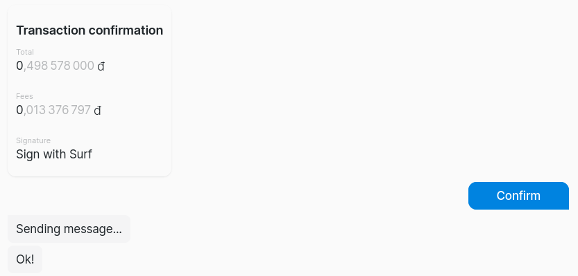

Return to Flex. Now you can use the EVERs you deposited to trade.

## How to buy/sell

Flex displays all available information about a token which can help you decide on a trade. Graphs visualize token status and history, while the **Orderbook** and **Trades** tabs list the currently available orders and accumulated trade statistics.

Your current assets on Flex are always displayed in the Wallets section:

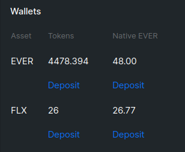

**Note:** Native EVER column **** displays the funds allocated for covering trading fees on your wallet. They are never traded, and slowly get spent on trading operations. They should be kept in the range ofafew dosen EVERs.

Decide on a trade, and fill in your order in the leftmost section of the page:

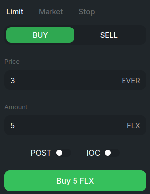

You can set your own price and amount, or click on an order in the **Orderbook** to fulfill it. Click the **Buy...** or **Sell...** button, once you're ready.&#x20;

If you set neither **POST** nor **IOC** flag:

* **When buying**: if the tokens you want to buy are available in the amount you're requesting at a price equal to the one you specified, Flex will facilitate the trade immediately for however many currently available tokens fit your conditions and create a buy order for the rest. If none are available, a buy order will be created for the whole amount.
* **When selling**: if there is a suitable buy order for the tokens you want to sell, or a part of it, the trade will be executed immediately, otherwise a buy order will be created for part or all of the tokens you are selling.

**POST** flag will place your order on the market to wait for someone else to fulfill it. You will become a market maker and benefit from Flex fees.

**IOC** flag creates and immediate-or-cancel order. If there are no orders on the market fitting yours, it will be cancelled. Otherwise, it will be immediately fulfilled.
