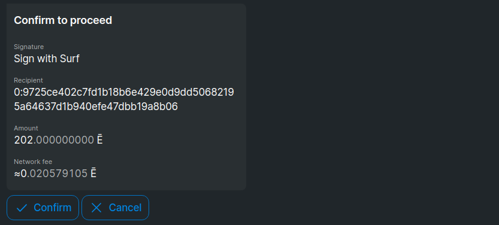
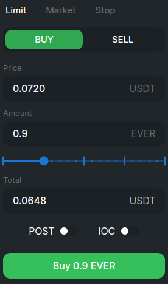
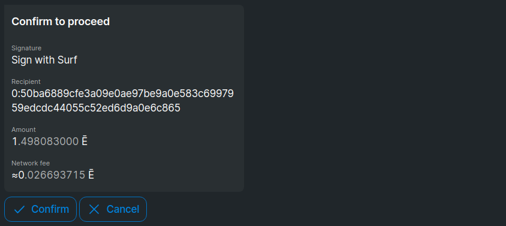
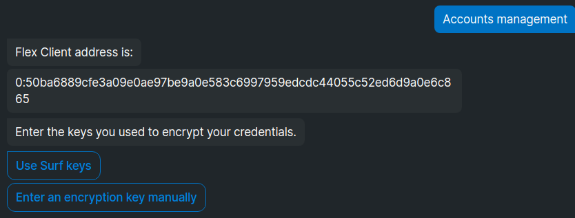
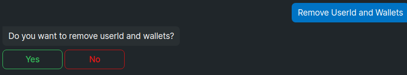
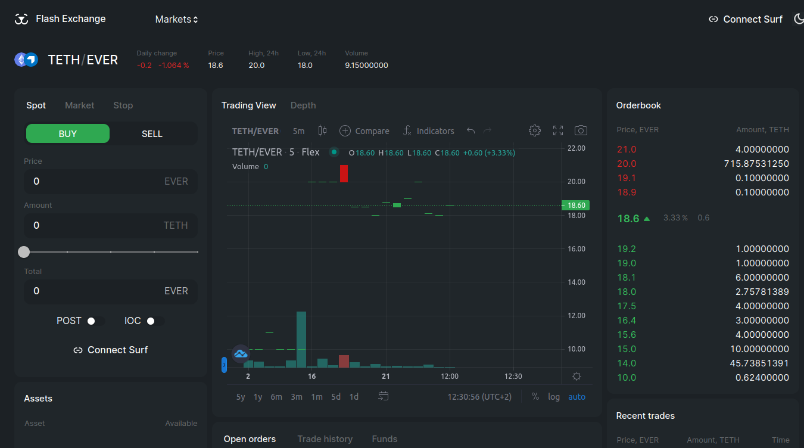

# Trade on Flex

## What can I trade?

You can buy any listed tokens, or sell any listed tokens you own.

Use the drop-down Markets to select a token you want to trade:

You will be able to deposit your funds into Flex to start trading any tokens listed there.

<figure><figcaption></figcaption></figure>

## How to get started

To trade on Flex you need to [Connect your Surf wallet](connect-your-wallet.md) and deposit some funds. Once this is done, all your funds on Flex will be shown in the Assets section.

<figure><figcaption></figcaption></figure>

## How to deposit

Usually some funds are deposited during the [initial authorization](connect-your-wallet.md).

If you want to deposit more, or didn't deposit any after authorizing, click on the **Deposit button** next to the Asset you want to deposit, or on the **Surf** button in the upper right corner.

Scan QR code or go to desktop Surf app.

The Flex Auth DeBot will launch. Select Deposit EVER or Deposit TIP-3.1, depending on the asset you want to deposit.

<figure><figcaption></figcaption></figure>

Enter amount to be deposited.

<figure><figcaption></figcaption></figure>

Enter amount to use for transaction fee (everything above the fee will be sent to the asset's Flex internal wallet and will be later used to pay for gas during transactions.

<figure><figcaption></figcaption></figure>

Confirm transaction.

<figure><figcaption></figcaption></figure>

Return to Flex. Now you can use the funds you deposited to trade.

## How to buy/sell

Flex displays all available information about a token which can help you decide on a trade. Graphs visualize token status and history, while the **Orderbook** and **Trades** tabs list the currently available orders and accumulated trade statistics.

<figure><figcaption></figcaption></figure>

Your current assets on Flex are always displayed in the Assets section:

<figure><figcaption></figcaption></figure>


**Gas** balance is the native EVERs you use to pay transaction fees. It should be [kept above 50](keep-up-gas-balance.md) to make sure you can perform any actions on Flex.


Decide on a trade, and fill in your order in the leftmost section of the page:

<figure><figcaption></figcaption></figure>

You can set your own price and amount, or click on an order in the **Orderbook** to fulfill it. You can also use the slider to set a fraction of your funds you want to spend.

If you set neither **POST** nor **IOC** flag:

* **When buying**: if the tokens you want to buy are available in the amount you're requesting at a price equal to the one you specified or better, Flex will facilitate the trade immediately **for the best available price** for however many currently available tokens fit your conditions and create a buy order for the rest. If no tokens are available for the specified price or better, a buy order will be created for the whole amount.
* **When selling**: if there is a buy order for all or part of the the tokens you want to sell at the price you specified or better, a trade will be executed immediately **for the best available price** for as many tokens as are available, and if not all tokens are sold, a sell order will be created for the remaining part of the tokens you are selling. If no suitable buy order is available. a sell order for the full amount will be created.

**Example**: Orderbook has two sell orders - 10 tokens for the price of 100 and 40 tokens for the price of 200. You send a buy order for 15 tokens for the price of 120. Flex executes a trade for the best price (100) for all available tokens (10) and creates a buy order for the remaining 5 tokens at the specified price of 120, as no tokens at that price are currently on sale.

**POST** flag will place your order on the market to wait for someone else to fulfill it. You will become a market maker and benefit from Flex fees.

**IOC** flag creates and immediate-or-cancel order. If there are no orders on the market fitting yours, it will be cancelled. Otherwise, it will be immediately fulfilled.

Click the **Buy** or **Sell** button, once you're ready.&#x20;

A notification confirming your order creation will appear in the top right corner.

While your order remains opened in the Orderbook, it is listed in your **Open orders** tab at the bottom of the page.

<figure><figcaption></figcaption></figure>

Once your order is fulfilled, it appears in your **Trade history** tab at the bottom of the page.

<figure><figcaption></figcaption></figure>

## How to withdraw

Go to the **Funds** section at the bottom and click Withdraw next to the asset you wish to withdraw.

<figure><figcaption></figcaption></figure>

Scan QR code or go to desktop Surf app.

The Flex auth DeBot will launch. Enter amount of tokens to unwrap (withdraw).

<figure><figcaption></figcaption></figure>

Select the address which is going to be the owner of the tokens you are withdrawing.&#x20;

<figure><figcaption></figcaption></figure>

Confirm transaction. It takes about 1.5 EVERs to perform.

<figure><figcaption></figcaption></figure>

You can see your withdrawn tokens in [https://ever.live](https://ever.live) on the page your Surf wallet in the **Token balances** section.

.png>)

## How to recover Gas balances

If the Flex Client owner wants to disable a trader account and to recover gas balances from the Flex token wallets, they can go to the Flex Auth DeBot (in Flex, click on **Surf** button in the top right corner, then scan QR or open Desktop App).

All gas balances from the Flex token wallets can be recovered, and tokens from these wallets can be transferred to external TIP-3.1 wallets belonging to the Surf account. The Flex Client gas balance can be recovered too.

In Flex Auth DeBot Select **Accounts management**.

<figure><figcaption></figcaption></figure>

Select the keys you used to encrypt the account credentials when [connecting your wallet](connect-your-wallet.md). Usually it's your Surf keys.

<figure><figcaption></figcaption></figure>

The DeBot will display the account you most recently authorized. (Click **Back** and select a different account, if you need to withdraw from an older account).

<figure><figcaption></figcaption></figure>

Click **Remove UserId and Wallets**.

<figure><figcaption></figcaption></figure>

Confirm the action. Several transactions to cancel all open orders of the account, withdraw assets and burn Flex token wallets will be generated .

Confirm the necessary transactions.

Once all transactions are performed, DeBot will report success and display the userId of all your other accounts and the option to recover Gas from the Flex Client. To recover Gas from other accounts, select one of the other accounts.

To recover Gas from the Flex Client, select the corresponding action.

<figure><figcaption></figcaption></figure>

Enter amount to recover and select address to transfer to.

<figure><figcaption></figcaption></figure>

Confirm the action.

<figure><figcaption></figcaption></figure>

Once done, DeBot will report success.

You can keep using your Flex Client further to [authorize](connect-your-wallet.md) new trading accounts.
