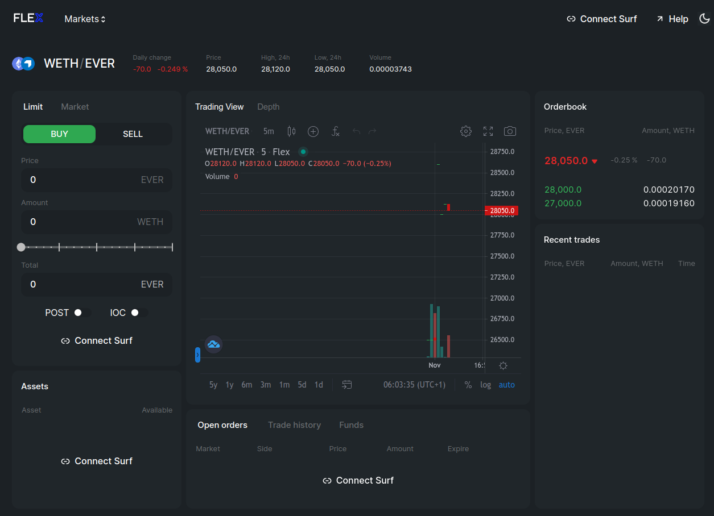

# Install Flex DApp

Currently Flex is available as a multi-platform desktop DApp.

To install Flex proceed to the Flex [downloads page](https://flexdex.fi/downloads.html) and download the suitable Flex package and install it with the standard method for your platform.

<figure><figcaption></figcaption></figure>

**Note**: Currently you may get a certificate warning when installing Flex for Windows. This is normal, you can safely ignore it and install the app.

When installed, launch the DApp. Without authorization you will be able to observe the current state of the Flex exchange, orderbook and trade history in all listed pairs.

<figure><figcaption></figcaption></figure>

To get started, make sure you [have some EVERs](get-evers.md) (and optionally, some TIP3 tokens) on your Surf account and proceed to [connect your Surf wallet](connect-your-wallet.md).
