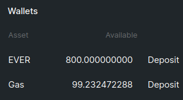

# Keep up Gas Balance

Flex works entirely on-chain as a set of smart contracts. This means that every action you take requires [blockchain fees](../flex-fees.md) to be paid.

To cover these fees Flex stores an amount of native EVER tokens as your **Gas balance**.

You allocate the initial amount to your Gas balance when connecting your wallet. After deployment it will be at a minimum of about 100 EVERs.

This balance will gradually be spent on deploying new internal wallets (30 EVERs per wallet) and topping them up as necessary, as they spend their balances on trades.

It is recommended to keep your Gas balance up above 50 EVERs at all times.

Its current value is always available in the Wallets section.

If it turns <mark style="color:red;">red</mark>, it needs to be topped up.

To top it up, click **Deposit** next to the **Gas** balance.

Scan the QR code or go to desktop Surf app.

Enter the amount to send to your Gas balance and confirm:

.jpg>)

