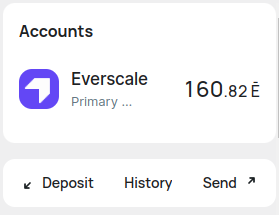
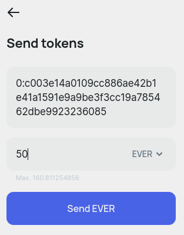

# Troubleshooting

This page lists the common problems a Flex user may encounter and the solutions to them.

## Cannot place orders

You may be too low on Gas - check, how much gas you have in your **Assets** section. If it is below 50, top it up.

Alternatively, Flex may have undergone a contract update. Restart the DApp and Flex Auth DeBot will help you [sync your account with the updated exchange](update-flex.md). You will be able to continue trading afterwards.

## Market order fails due to insufficient funds

This may happen, if you decided to make a market order for 100% of your funds and the market price shifted significantly while your order was being processed.

You simply do not have enough funds to trade at the current price and pay the fees anymore.

Redo the order, and try to avoid trading 100% of your funds all at once.

## Not enough tokens on Flex Client balance

This is an error most commonly encountered trying to create a new user after deleting your user.

It means that Flex Client contract associated with your Surf account does not have enough tokens to perform whatever action you are currently trying to do.&#x20;

To fix this problem, you need to top up the balance of your Flex Client.

#### Web DApp

When this error appears in the web dApp, it will display your Flex client address.

Copy it, open our Ever Surf keeper and click **Send.**

<figure><figcaption></figcaption></figure>

Paste your Flex Client address, enter the amount of tokens to be sent (unspent amount can be recovered later), click **Send EVER** and confirm transaction.

<figure><figcaption></figcaption></figure>

#### Desktop DApp

In the Desktop DApp, this error usually appears in the Auth DeBot during authorization.

<figure><figcaption></figcaption></figure>

You can top up the balance using your Surf wallet's funds right here in the DeBot.

Just click **Transfer from my wallet**, and confirm the resulting transaction:

<figure><figcaption></figcaption></figure>

Once the DeBot confirms successful transfer, it will return you to whatever you were doing, that caused this error, and you will be able to continue.

**Manual option**

If you want to top up your Flex Client  manually from some other account, or by another amount, you'll need your Flex Client address. It is usually located at the top of your dialogue with the DeBot.

Tap (in the mobile app) or click and hold (in the desktop app) the Flex Client address.&#x20;

<figure><figcaption></figcaption></figure>

To check the current Flex Client balance go to [ever.live](https://ever.live/) and paste this address in the search string.

The account page will display the current balance.

<figure><figcaption></figcaption></figure>

Now you can top it up with your preferred method.

For example, in Surf, go to the main Surf screen and click **Send**.

<figure><figcaption></figcaption></figure>

Fill in the Flex Client address and amount and send the necessary tokens.

<figure><figcaption></figcaption></figure>

Once you have topped up the Flex Client, go back to the DeBot dialogue and choose **I did it myself**.

<figure><figcaption></figcaption></figure>

The DeBot will return you to whatever you were doing.

## Desktop DApp login issues

If you encounter any issues logging into the Flex DApp, try deleting the session and retrying authorization with the same login and password - click **Delete account and start a new session** on the Sign in window:

<figure><figcaption></figcaption></figure>

Then reenter the credentials anew.\
Flex Auth DeBot will launch and update your keys, after which you will be able to use your account as usual.

## Lost Desktop DApp login and/or password

Flex has no built-in way to recover an account if you forgot its credentials. You can however use Surf to make a new account, and then recover all your funds from the old one.

To create a new account click **Delete account and start a new session** on the Flex Login screen:

<figure><figcaption></figcaption></figure>

Then [authorize a new Flex account](desktop-dapp/connect-your-wallet.md) using the same Surf. You may need to [top up your Flex Client ](troubleshooting.md#not-enough-tokens-on-flex-client-balance)for that.

Once authorization is complete, click **Accounts management** in the DeBot menu.

<figure><figcaption></figcaption></figure>

Enter encryption keys (usually it's Surf keys).

<figure><figcaption></figcaption></figure>

The first account that will be displayed is your newly created account. You don't need to remove it.

<figure><figcaption></figcaption></figure>

Click **Back** and select the account you lost the credentials for (usually it's the one higher up in the list):

<figure><figcaption></figcaption></figure>

Review the funds on the selected account, and if it's the lost one, click **Remove UserId and Wallets**.

<figure><figcaption></figcaption></figure>

Then follow DeBot instructions, until the account is removed. All tokens, in orders or otherwise and will be returned to you. Gas balance will be sent to Flex Client and can also be [recovered](desktop-dapp/how-to-trade-on-flex.md#how-to-recover-gas-balances).

## Other errors with order processing

Error notifications are usually self explanatory, and for the most part you can retry after adjusting your order accordingly. If you encounter unknown errors, or need any other kind of help, you can ask about it in the [Telegram group](https://t.me/flexdexbeta).
