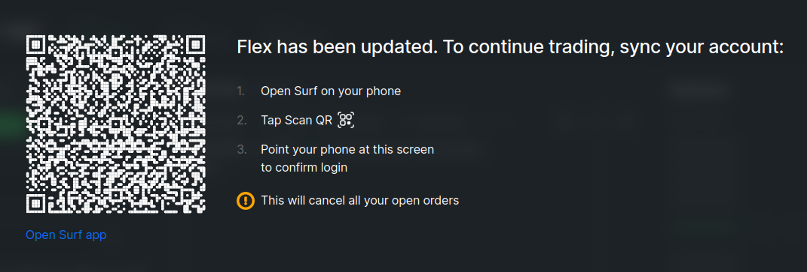
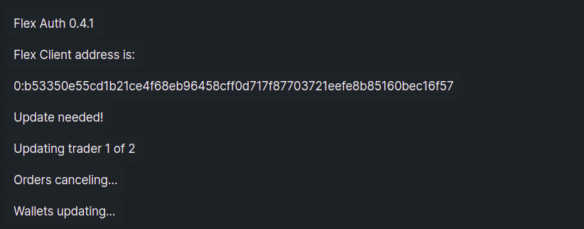
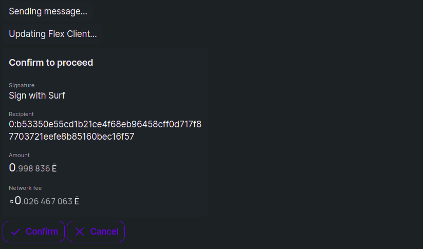
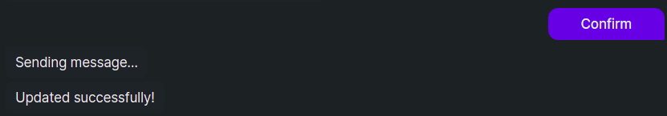
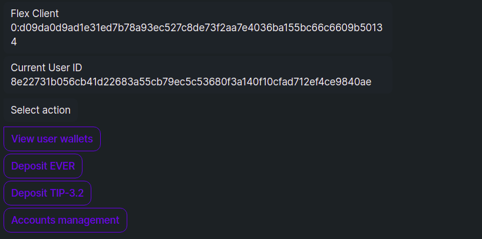
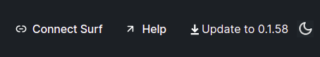

# Update Flex

There are two types of updates in Flex: Flex smart contract updates and DApp updates.

## Update Flex account

Occasionally the on-chain contracts of the Flex exchange itself will be updated. However, to ensure security of user funds, no contracts belonging to the user (wallets, Flex Client, etc.) can be updated without user authorization.

Follow the guide below to authorize your user contract update and sync your account with the updated core Flex contracts.

#### If you use the Web version

When Flex has undergone a contract update, you will see the a popup, notifying you of this, when you connect your wallet. Follow the suggested steps and confirm the necessary transactions with your Surf Keeper extesion, to sync your account to the updated Flex.

#### If you use the DApp

When Flex has undergone a contract update, you will see the following screen once you log into your Flex account:

<figure><figcaption></figcaption></figure>

Scan the QR code or click **Open Surf app** and proceed to the Flex DeBot in Surf.


This will cancel all your open orders and return the funds reserved in them to your Flex balances.


<figure><figcaption></figcaption></figure>

Depending on how many trader accounts and open orders you have, and on how extensive the required update is, the DeBot will perform one or more update steps and ask you to confirm a few transactions. The [fees](../specifications/flex-fees.md#update-fees) for all update actions will be paid from your Gas balance.

<figure><figcaption></figcaption></figure>

Once done, it will report success and display the usual Flex DeBot menu.

<figure><figcaption></figcaption></figure>

<figure><figcaption></figcaption></figure>

Now you can return to Flex and continue trading on the updated exchange.

## Update DApp

DApp updates are frequent and straightforward. The DApp will display a notification about the available update in the top right corner of the main screen.&#x20;

<figure><figcaption></figcaption></figure>

Download the suggested package and install it as usual.
