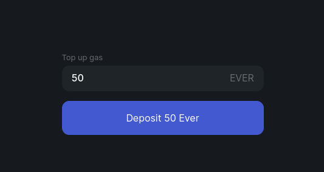

# Keep Up Gas Balance

Flex works entirely on-chain as a set of smart contracts. This means that every action you take requires [blockchain fees](../../specifications/flex-fees.md) to be paid.

To cover these fees Flex stores an amount of native EVER tokens as your **Gas balance**.

You allocate the initial amount to your Gas balance when [connecting](connect-your-wallet.md) your wallet.&#x20;

This balance will gradually be spent on trading and deploying new internal wallets whenever you acquire an asset you did not previously own (\~10 EVERs per new asset wallet).

Its currently available value is always displayed in the top right corner of the Flex window.

<figure><figcaption></figcaption></figure>

**Note**: The balance displays your total gas on Flex. Of this amount 20 EVERs are reserved on your Flex Client contract for various system actions. The rest is used to pay for gas on the exchange.&#x20;

If the balance turns <mark style="color:red;">red</mark>, it needs to be topped up.

To top it up, click on the displayed **Gas** balance.

Enter the amount to send to your Gas balance and confirm any generated transactions:

<figure><figcaption></figcaption></figure>


In the Flex Web DApp, when gas falls below 10 Ever, it will be topped up by a small amount automatically. If you trade actively or in large amounts, it is recommended not to rely on auto top up, as in certain conditions this amount may not be enough to complete particularly large orders, or a large amount of sequentially placed orders.

