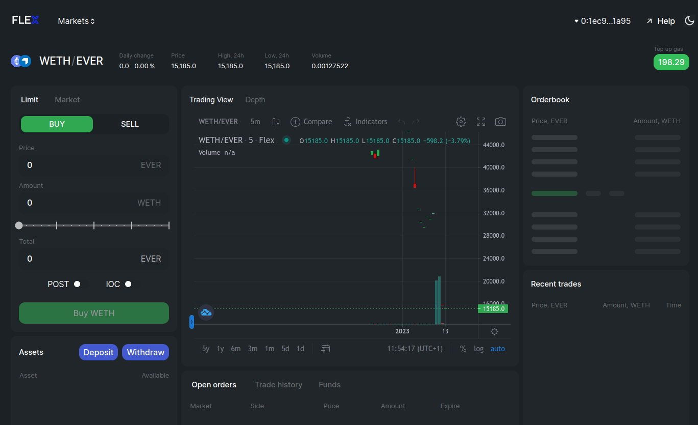
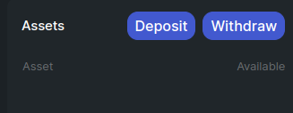
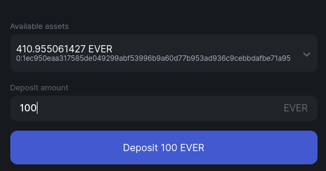
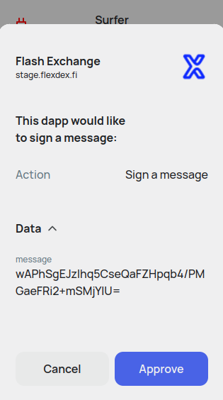
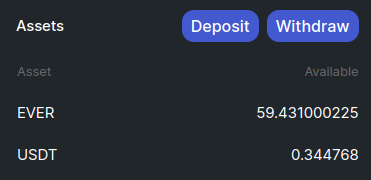
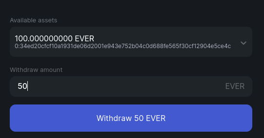
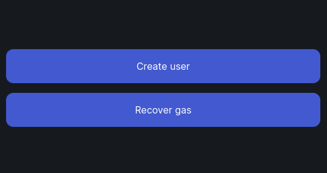

# Trade on Flex

## What can I trade?

You can buy any listed tokens, or sell any listed tokens you own.

Use the drop-down Markets to select a token you want to trade:

You will be able to deposit your funds into Flex to start trading any tokens listed there.

<figure><figcaption></figcaption></figure>

## How to get started

To trade on Flex you need to [Connect your Surf wallet](connect-your-wallet.md). Once you're authorized, you can see your user wallet address and current gas balance in the top right corner.

<figure><figcaption></figcaption></figure>

## How to deposit

Click the **Deposit button** in the **Assets** section.

<figure><figcaption></figcaption></figure>

Select the assets you want to deposit.

<figure><figcaption></figcaption></figure>

Approve the request and sign the necessary transactions in the Surf Keeper.

<figure><figcaption></figcaption></figure>

 

<figure><figcaption></figcaption></figure>

 

<figure><figcaption></figcaption></figure>


For now you will have to manually confirm all Flex transactions. In the next updates you will be able to add Flex as a trusted DApp in your Surf Keeper, and all actions will be significantly streamlined.


Your deposited funds will appear in the **Assets** section. Now you can use them to trade.

<figure><figcaption></figcaption></figure>

## How to buy/sell

Flex displays all available information about a token which can help you decide on a trade. Graphs visualize token status and history, while the **Orderbook** and **Trades** tabs list the currently available orders and accumulated trade statistics.

<figure><figcaption></figcaption></figure>

Your current assets in the current pair are always displayed in the Assets section:

<figure><figcaption></figcaption></figure>

Decide on a trade, and fill in your order in the leftmost section of the page:

<figure><figcaption></figcaption></figure>

For Limit orders you can set your own price and amount, or click on an order in the **Orderbook** to fulfill it. You can also use the slider to set a fraction of your funds you want to spend.

If you set neither **POST** nor **IOC** [flag](trade-on-flex.md#post-and-ioc-flags):

* **When buying**: if the tokens you want to buy are available in the amount you're requesting at a price equal to the one you specified or better, Flex will facilitate the trade immediately **for the best available price** for however many currently available tokens fit your conditions and create a buy order for the rest. If no tokens are available for the specified price or better, a buy order will be created for the whole amount.
* **When selling**: if there is a buy order for all or part of the the tokens you want to sell at the price you specified or better, a trade will be executed immediately **for the best available price** for as many tokens as are available, and if not all tokens are sold, a sell order will be created for the remaining part of the tokens you are selling. If no suitable buy order is available, a sell order for the full amount will be created.

**Example**: Orderbook has two sell orders - 10 tokens for the price of 100 and 40 tokens for the price of 200. You send a buy order for 15 tokens for the price of 120. Flex executes a trade for the best price (100) for all available tokens (10) and creates a buy order for the remaining 5 tokens at the specified price of 120, as no tokens at that price are currently on sale.

#### POST and IOC Flags

**POST** flag will place your order on the market to wait for someone else to fulfill it. You will become a market maker and benefit from Flex fees.

**IOC** flag creates an immediate-or-cancel order. If there are no orders on the market fitting yours, it will be cancelled. Otherwise, it will be immediately fulfilled.

Click the **Buy** or **Sell** button, once you're ready.&#x20;

A notification confirming your order creation will appear in the top right corner.

Market orders simply let you buy or sell a certain amount at the current market price.

<figure><figcaption></figcaption></figure>


For now you will have to manually confirm all Flex transactions. In the next updates you will be able to add Flex as a trusted DApp in your Surf Keeper, and all actions will be significantly streamlined.


<figure><figcaption></figcaption></figure>

 

<figure><figcaption></figcaption></figure>

 

<figure><figcaption></figcaption></figure>

While your order remains opened in the Orderbook, it is listed in your **Open orders** tab at the bottom of the page.

<figure><figcaption></figcaption></figure>

Once your order is fulfilled, it appears in your **Trade history** tab at the bottom of the page.

<figure><figcaption></figcaption></figure>

## How to withdraw

Click the **Witdraw button** in the **Assets** section.

<figure><figcaption></figcaption></figure>

Select the assets you want to withdraw.

<figure><figcaption></figcaption></figure>

Approve the request and sign the necessary transactions in the Surf Keeper.

<figure><figcaption></figcaption></figure>

 

<figure><figcaption></figcaption></figure>

 

<figure><figcaption></figcaption></figure>


For now you will have to manually confirm all Flex transactions. In the next updates you will be able to add Flex as a trusted DApp in your Surf Keeper, and all actions will be significantly streamlined.


You can see your withdrawn tokens in Surf Keeper and on [https://ever.live](https://ever.live) on the page of your Surf wallet in the **Token balances** section.

<figure><figcaption></figcaption></figure>

## How to delete account and recover Gas balances

If you want to disable a Flex account and to recover gas balances from the Flex token wallets, open the user menu in the top right corner. Click **Remove user**.

<figure><figcaption></figcaption></figure>

Confirm the necessary transactions.

<figure><figcaption></figcaption></figure>

 

<figure><figcaption></figcaption></figure>

 

<figure><figcaption></figcaption></figure>

Wait while all stages of the process complete (confirm any transactions that are created once this happens).


Any opened orders will be cancelled during this process, and any tokens you haven't withdrawn previously will be withdrawn to your Surf account,


<figure><figcaption></figcaption></figure>

 

<figure><figcaption></figcaption></figure>

 

<figure><figcaption></figcaption></figure>

Once the user id deleted, you have the option to create a new user, or to recover remaining gas balance.

<figure><figcaption></figcaption></figure>
