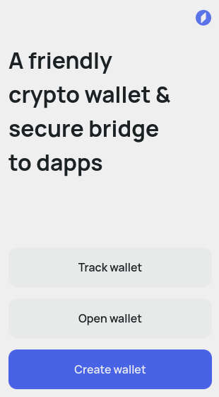

# Connect Your Wallet

Currently you can use the Flex web version in Chrome and Chromium browsers.

To get started trading in the web version of Flex you need to have a [Surf wallet](../get-evers.md) with your tokens [opened](connect-your-wallet.md#install-surf-keeper-extension-if-you-dont-have-it) (not tracked) in the [Ever Surf Keeper extension](https://chrome.google.com/webstore/detail/ever-surf-keeper/dfldeefnhahdhaolbkhehhlcgagefgff).

Follow this guide to get authorized in Flex by connecting your wallet.

### Get started

Open Flex and click **Connect Wallet**.

<figure><figcaption></figcaption></figure>

Select Ever Surf Keeper in the popup.

<figure><figcaption></figcaption></figure>

If you already have it installed, [authorization](connect-your-wallet.md#connect-wallet-to-flex) will start. Otherwise, you will be redirected to the extension store to install the browser extension.

### Install Surf Keeper extension, if you don't have it

<figure><figcaption></figcaption></figure>

Once installed, open the extension and click **Open Wallet** (if you have it), or **Create Wallet** (if you don't).

<figure><figcaption></figcaption></figure>

Enter your seed phrase if you are opening an existing wallet, or backup the newly generated seed phrase, if you are creating one.


Make sure to back up your seed phrase securely, and never share it with anyone. It gives full access to all your funds on Surf and associated Flex account.


Check that you have all the tokens you need displayed in the Keeper extension. Refer to this [guide](../get-evers.md) on how to get EVERs or transfer other tokens to Everscale.

<figure><figcaption></figcaption></figure>

### Connect Wallet to Flex

When you have the extension installed and ready and select Ever Surf Keeper in the **Connect Wallet** popup, Flex will send a connection request to Surf Keeper.

<figure><figcaption></figcaption></figure>

Approve the request and sign the necessary transactions.

<figure><figcaption></figcaption></figure>

 

<figure><figcaption></figcaption></figure>

 

<figure><figcaption></figcaption></figure>

 

<figure><figcaption></figcaption></figure>


For now you will have to manually confirm all Flex transactions. In the next updates you will be able to add Flex as a trusted DApp in your Surf Keeper, and all actions will be significantly streamlined.


Your first time on Flex some system smart contracts will have to be deployed.

Since Flex works entirely on-chain, all actions and all smart contracts, such as your Flex wallets, require native EVERs to cover blockchain fees. Your Gas balance will be gradually spent on these fees.

Enter how much EVERs to deposit to your gas balance initially. 150 EVERs are enough to start with a few trades. If you plan to trade intensively, more is advised. You can always top up this balance later, and, conversely, withdraw any unspent amount if you want to stop using Flex.

<figure><figcaption></figcaption></figure>

Wait for all system contracts to be deployed (confirm any transactions the Keeper prompts you to, while this happens).

<figure><figcaption></figcaption></figure>

Once ready, Flex will report success and display your Flex Client address. You may need it for troubleshooting or some other tasks later.

<figure><figcaption></figcaption></figure>

You are now ready to start using Flex.

<figure><figcaption></figcaption></figure>

Currently available Gas balance is displayed in the top right corner. It will gradually be spent on all your actions on Flex. Make sure to [keep it above 50 tokens](keep-up-gas-balance.md) to be able to trade anything on Flex.

<figure><figcaption></figcaption></figure>
