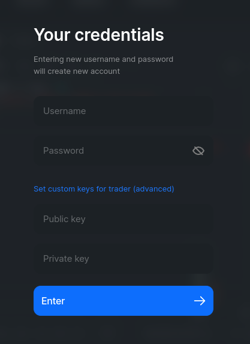

# Log into DApp with Trader Keys

If you run some trading software on Flex, e.g. using [Flex SDK](https://github.com/tonlabs/flex-sdk-js), you have your trader keys set explicitly in it. Should you want to view your trades in the GUI, you may use those keys to log in to the Flex DApp.

On the DApp login screen click **Set custom keys for trader (advanced)** and enter your private and public keys in addition to a username and password:

<figure><figcaption></figcaption></figure>

**Note**: Only the keys are preset in your trading software. Username and password are newly set at this point and only used to work with the DApp.

**Note 2**: Currently you will not be able to launch DeBots for this account in Surf. On the other hand, trading within Flex DApp will be functional.
