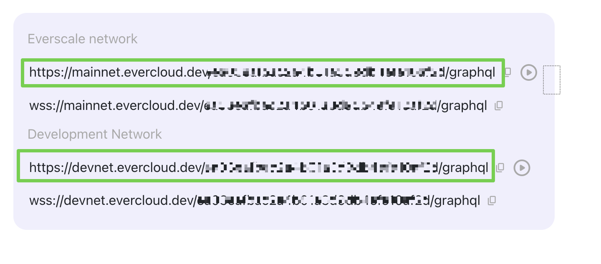
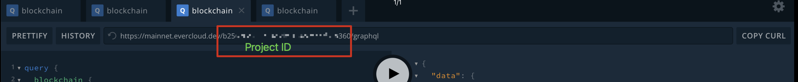

# Quick Integration Guide

## Developer links

* Flex JS SDK repository: [https://github.com/tonlabs/flex-sdk-js](https://github.com/tonlabs/flex-sdk-js)
* Flex JS SDK Reference: [https://tonlabs.github.io/flex-sdk-js/index.html](https://tonlabs.github.io/flex-sdk-js/index.html)
* GraphQL API TestNet Playground: [https://test.flex.everos.dev/graphql](https://test.flex.everos.dev/graphql) . Observe Flex API documentation under `Flex` root query
* General Flex Documentation: [https://docs.flexdex.fi/](https://docs.flexdex.fi/)

## Overview

This is a one-page document to kick-off integration of your project with Flex.

There are 2 possible integration scenarios:

* You have your own funds to operate on Flex: perform such operations as deposit, trade and withdraw.
* You have funds delegated from another party and will perform only trading on Flex.

## Glossary

* **Flex Client** - Entity that manages Flex funds: deposits tokens, adds Traders, delegates tokens to Traders and revokes tokens from Traders.
* **Trader** - Entity that performs trading operations on flex: makes orders, cancel orders. Each trader has an ID and an index contract deployed for that ID. Index contract is also used to pay gas for Flex operations.

## Get API endpoint

Register in Evercloud to get your endpoint [https://docs.everos.dev/ever-platform/products/evercloud/get-started](https://docs.everos.dev/ever-platform/products/evercloud/get-started).

To work on Flex in devnet, use your devnet Evercloud endpoint, to work on Flex in mainnet use your mainnet endpoint:

<figure><figcaption></figcaption></figure>

To open playground click on the play button.

&#x20;⚠️ You need to add your projectID to the url inside the playground to access it.

<figure><figcaption></figcaption></figure>

## Install Flex SDK

Go to the GraphQL playground and get Super Root address with this query

```graphql
query{
  flex{
    address
  }
}
```

Configure Flex SDK with the `superRoot` address and endpoint.

```jsx
import { TonClient } from "@eversdk/core";
import { libNode } from "@eversdk/lib-node";
import { Flex, FlexConfig } from "../flex";

TonClient.useBinaryLibrary(libNode);
const FLEX_CONFIG: Partial<FlexConfig> = {
    evr: {
        sdk: {
            network: {
                endpoints: ["FLEX ENDPOINT"],
            },
        },
    },
    superRoot: "Super Root address",
};
const flex = new Flex(FLEX_CONFIG);
```

## Go on Flex with your own funds

### Prepare your wallet with EVERs

First, you need to have a wallet with EVERs to start the whole process.

1. Install either [Surf](https://ever.surf/) or [Ever Wallet](https://everwallet.net/) for that.
2. Transfer EVERs to this wallet
3. Retrieve the Seed Phrase from the wallet (12 or 24 words).

### Prepare Fungible Tokens (optional)

Now you have only EVERs.

You can either deposit EVERs or TIP 3.2 Tokens to Flex.

If you want to deposit TIP 3.2 as well, then you need to swap some of your EVERS to TIP 3.2.

**Let’s find out what TIP 3.2 tokens are traded on Flex.**

Run this query to see the available pairs and their token tickers:

```graphql
query{
  flex{
    pairs{
      address # Flex Market address
      ticker
      major{
				ticker
      }
      minor{
				ticker
      }
    }
  }
}
```

Now you know the symbol (ticker) of TIP 3.2 token and you can use any swap tool to swap EVERs (or other TIP.2 tokens you have) to this TIP 3.2: use Surf [swap tool](https://help.ever.surf/en/support/solutions/articles/77000525946-how-to-swap-tokens-in-surf), or [FlatQube](https://app.flatqube.io/swap).

After you swapped tokens, you are ready to deposit both EVER and TIP 3.2 tokens on Flex.

Now you need to identify your TIP 3.2 wallet addresses. You will need them later, to deposit on Flex.

You can use [**Evercloud FT API**](https://docs.everos.dev/ever-platform/products/evercloud/get-started), like this:

```graphql
{
  ft{
    holder(address:"0:d807caf6df3a7c2bb0b64915613eca9d8f17ca1de0b938dfdcbb9b4ff30c4526"){
      wallets{
        edges{
          node{
            address # Your Tip 3.2 wallet address
            token{
              symbol
              decimals
            }
            balance # in smallest units, see decimals to convert to tokens
          }
        }
      }
    }
  }
}
```

### Create Flex Client

To manage funds on Flex, you need to have a Flex Client contract. Let’s create it.

#### Prepare Flex Client Signer

First, you need to prepare Flex Client Signer to deploy it.

You can use [everdev](https://docs.everos.dev/everdev/) tool for key management.

Go to your EVER wallet and export the Seed Phrase. Then run this

```bash
npm i -g everdev 
everdev signer add everWallet "your seed phrase here"
everdev signer info everWallet
{
    "name": "everWallet",
    "description": "",
    "keys": {
        "public": "***",
        "secret": "***"
    },
    "mnemonic": {
        "dictionary": 1,
        "phrase": "your seed phrase here"
    }
}
```

Now you can use either alias “everWallet” or keys.secret string as `signer` to work with your Flex Client.

#### Deploy Flex Client

⚠️ If you already deployed Flex Client via DeBot, you don’t need to perform this step. But if you can not find Flex Client address in your DeBot - you can run Client.deploy to find it. Deploy will not work twice, don’t worry about your funds.

```tsx
const clientAddress = await Client.deploy(flex, {
    everWallet: {
        address: "everWallet address",
        signer: "everWallet",
    },
    signer: "everWallet",
    
});
console.log(`Client: ${clientAddress}}`);
```

### Create a trader

If you, as a company or person, are going to both manage funds and trade, you should also deploy Trader and delegate it some funds.

First, you need to get the Trader’s public key. Let’s generate a key pair for the Trader. If you don’t want to have responsibility for the trader’s keys, ask the person who is going to be the trader, to generate the key pair and give you the pubkey.

You can use [everdev](https://docs.everos.dev/everdev/) tool for key management.

```tsx
npm i -g everdev 
everdev signer generate --mnemonic --dictionary 1 traderSigner
everdev signer info traderSigner
{
    "name": "traderSigner",
    "description": "",
    "keys": {
        "public": "6da814df0fc0316f9d04999fb019019420341173c36f9bde4f68e75ed447dca4",
        "secret": "d28777ee18fe68ec152e1569018b5e61e33918ff304a8eff6d6c5ed98df63a35"
    },
    "mnemonic": {
        "dictionary": 1,
        "phrase": "response gossip nest foot above insect lava firm brain point believe win"
    }
}
```

To deploy the Trader you need to have 40 EVERs on Flex Client contract. This value can be changed in flex-sdk-js config.

Flex Client deploys the Trader’s index contract:

```tsx
// traderId is just a random number, should be unique for each trader of the Flex Client
const traderId = "a51a2ccb21eddfda9069aabc76faba5840f361b7a0c6eb51c925af44156a2801";
await Trader.deploy(flex, {
    client: {
        address: clientAddress,
        signer: "everWallet",
    },
    id: traderId,
    name: "any-random-trader-name",
    pubkey: "traderSigner pubkey" 
});
```

### Delegate funds

#### Get wrapper addresses

In order to deposit tokens on Flex you need to know Flex Token Wrapper addresses and Flex Token Vault address.

Use Flex query to get all Pairs information.

☝🏻 Note that EVER wrapper does not have a Tip 3.2 Token Wallet address. EVERs are deposited directly into the wrapper.

```graphql
query{
  flex{
    pairs{
			address # Flex Market address
      ticker
      major{
				ticker
        address # Token Wrapper address
        externalAddress # Tip 3.2 Token Wrapper wallet address (plays role of external token Vault)
      }
      minor{
        ticker
        address # Token Wrapper address
        externalAddress # Tip 3.2 Token Wrapper wallet address (plays role of external token Vault)
      }
    }
  }
}
```

#### Deposit and delegate EVERs

```tsx
let trader_ever_wallet = await Trader.deployEverWallet(flex, {
    clientAddress: clientAddress,
    everWallet: {
        address: "everWallet adress",
        signer: "everWallet",
    },
    tokens: 100,
    evers: 20,
    keepEvers: 15,
    traderId: traderId,
    wrapperAddress: "Ever wrapper address",
});

flex.evr.log.info("Trader EVER wallet address:", trader_ever_wallet, "has been topped-up.");
```

#### Deposit and delegate TIP 3.2

```tsx
let trader_tip3_wallet = await Trader.deployTip31Wallet(flex, {
      clientAddress: clientAddress,
      everWallet: {
          address: "everWallet address",
          signer: "everWallet",
      },
      traderId: traderId,
			// Tip 3.2 wallet address (that we got from Evercloud FT API above)
      tokenWalletAddress: "0:d4208262595226ac069b94d716ec6339882ec93a0e7e254186f3eb77b7d34c4b",
      // Wrapper address of Tip 3.2 Token (that we got from Flex API above)
			tokenWrapperAddress: "0:b10af0f3b17440d3a152e78b7dd971be7d47bc3299aa465bf7ceddb79660b948",
      // External Tip 3.2 wallet of Token Wrapper (externalAddress, that we got from Flex API above)
			tokenWrapperWalletAddress: "0:69d1ab51377f2fa29fc121b956b96f01f9234b9a3579552d0ec526c1d6e66613",
      tokenUnits: "10000000000"
  },
);
```

#### Check your Trader balances

Take your Trader credentials (client address and traderId) and check Trader balances now

```jsx
import { Flex, FlexConfig, Trader } from "../flex";

console.log(`Trader Wallets`, JSON.stringify(
    await Trader.queryWallets(flex,
        {
            clientAddress,
            traderId
        },
    ), undefined, "   "));
```

## Go on Flex with delegated funds

When trading on Flex with delegated funds, Trader can perform only MakeOrder/CancelOrder operations, meanwhile Flex Client can revoke funds at any moment.

So, if this is your case, you need to generate your pair of keys and give your pubkey (not private key!) to the person who owns Flex Client and manages the funds.

If you both manage funds and trade, refer to the first section: How to go on Flex with your funds.

### Generate Trader Key pair

At first you need to generate your keypair that will only be stored on your side.

⚠️ No one, including the Funds delegator should have access to your private key or seed phrase.

Its public key will be used to deploy Trader’s wallet with delegated funds limited to executing trades on Flex only.

You can use [everdev](https://docs.everos.dev/everdev/) to generate keys.

```bash
npm i -g everdev 
everdev signer generate --mnemonic --dictionary 1 traderSigner
everdev signer info traderSigner
{
    "name": "traderSigner",
    "description": "",
    "keys": {
        "public": "6da814df0fc0316f9d04999fb019019420341173c36f9bde4f68e75ed447dca4",
        "secret": "d28777ee18fe68ec152e1569018b5e61e33918ff304a8eff6d6c5ed98df63a35"
    },
    "mnemonic": {
        "dictionary": 1,
        "phrase": "response gossip nest foot above insect lava firm brain point believe win"
    }
}
```

Now you can use either “traderSigner” (everdev keypair name) or “d28777ee18fe68ec152e1569018b5e61e33918ff304a8eff6d6c5ed98df63a35” string as `signer` parameter in Flex SDK below.

#### Alternative: Generate keys with tonos-cli

You can use [everdev](https://docs.everos.dev/everdev/) to install the latest version of TONOS-CLI.

```bash
$ npm i -g everdev 
$ tonos-cli install
```

After it is installed, you can use TONOS-CLI to generate your pair of keys.

First create your seed phrase:

```jsx
tonos-cli genphrase
```

Back up your seed phrase safely, your keys can always be restored from it.

To create a key pair file from a seed phrase use the following command:

```bash
tonos-cli getkeypair <keyfile.json> "<seed_phrase>"
```

`<keyfile.json>` - the resulting file the key pair will be written to. `"<seed_phrase>"` - seed phrase generated on the previous save.

Example:

```jsx
$ tonos-cli getkeypair keyfile.json "vast essence mosquito inhale clap arena lobster cliff volcano treat verify sick"
Config: default
Input arguments:
key_file: keyfile.json
  phrase: vast essence mosquito inhale clap arena lobster cliff volcano treat verify sick
Succeeded.
```

### Get your Trader credentials

Give your generated **pubkey** to the person who manages funds on Flex (owner of Flex Client).

That person will provide you with these credentials:

* ID
* name
* Client address
* Wallets with wrapped tokens

### Check balances after delegation

After you have been delegated some funds, you can check your balances like this:

```jsx
import { Flex, FlexConfig, Trader } from "../flex";

console.log(`Trader Wallets`, JSON.stringify(
    await Trader.queryWallets(flex,
        {
            clientAddress,
            traderId
        },
    ), undefined, "   "));
```

## Trade

### Make an order

Now, it’s time to make an order.

You will need:

* trader signer - the pair of keys you generated above. You can use everdev signer name or private key hex string as a signer
*   marker address - trading pair address. You can query available pairs in the GraphQL playground with this query. Check documentation in the playground for other available fields:

    ```graphql
    query{
      flex{
        pairs{
          address
          ticker
        }
      }
    }
    ```

By default `IOP` order will be created.

You can check the full list of order types here: [https://tonlabs.github.io/flex-sdk-js/enums/exchange.MakeOrderMode.html](https://tonlabs.github.io/flex-sdk-js/enums/exchange.MakeOrderMode.html)

```jsx
import { Flex, FlexConfig, Trader } from "../flex";

await Trader.makeOrder(
    flex,
    {
        clientAddress: clientAddress,
        trader: {
            id: traderId,
            signer: 'traderSigner'
        },
        sell: true,
        marketAddress: marketAddress,
        price: 2.6,
        amount: 18,
    },
);

console.log(`Order: ${JSON.stringify(order, undefined, "    ")}\\n`);
```

### Cancel order

```tsx
let orderInfo = await Trader.cancelOrder(
flex,
{
    clientAddress: clientAddress,
    trader: {
        id: traderId,
        signer: "traderSigner",
    },
    marketAddress: marketAddress,
    price: { tokens: 10 },
    orderId: "0x1355df445d27aca1",
    waitForOrderbookUpdate: true
},
);
```

### See your open orders and trade history

```jsx
import { Flex, FlexConfig, Trader } from "../flex";

console.log(`Trader Orders`, JSON.stringify(await Trader.queryOrders(flex, traderId), undefined, "   "));
console.log(`Trader Trades`, JSON.stringify(await Trader.queryTrades(flex, traderId), undefined, "   "));
console.log(`Trader Wallets`, JSON.stringify(
    await Trader.queryWallets(flex,
        {
            clientAddress,
            traderId
        },
    ), undefined, "   "));
```

### Top-up balances to pay fees

Trade operations use gas and are subject to fees, so, in order to check that your balances have enough money, you can use Trader.

Balances that require top-up are: User Index contract and all Flex Wallets. This function tops them all up to the minimum balance you specify, and, if you need, add more on top.

```jsx
const topUpOptions: TopUpOptions = {
            client: clientAddress,
            id: traderId,
            everWallet: {
			          address: "everWallet address",
			          signer: "everWallet",
			      },
						minBalance: 80, // in EVERs
            value: 10, // in EVERs
        };
log.info(await Trader.getTopUpInfo(flex, topUpOptions)); 
await Trader.topUp(flex, topUpOptions);
```

## Full Reference

[https://tonlabs.github.io/flex-sdk-js/](https://tonlabs.github.io/flex-sdk-js/)

## Samples

How to run samples → [https://github.com/tonlabs/flex-sdk-js#examples](https://github.com/tonlabs/flex-sdk-js#examples)

Samples → [https://github.com/tonlabs/flex-sdk-js/tree/main/examples](https://github.com/tonlabs/flex-sdk-js/tree/main/examples)

How to run tests → [https://github.com/tonlabs/flex-sdk-js#integration-tests](https://github.com/tonlabs/flex-sdk-js#integration-tests)

Tests → [https://github.com/tonlabs/flex-sdk-js/tree/main/integration-test](https://github.com/tonlabs/flex-sdk-js/tree/main/integration-test)
