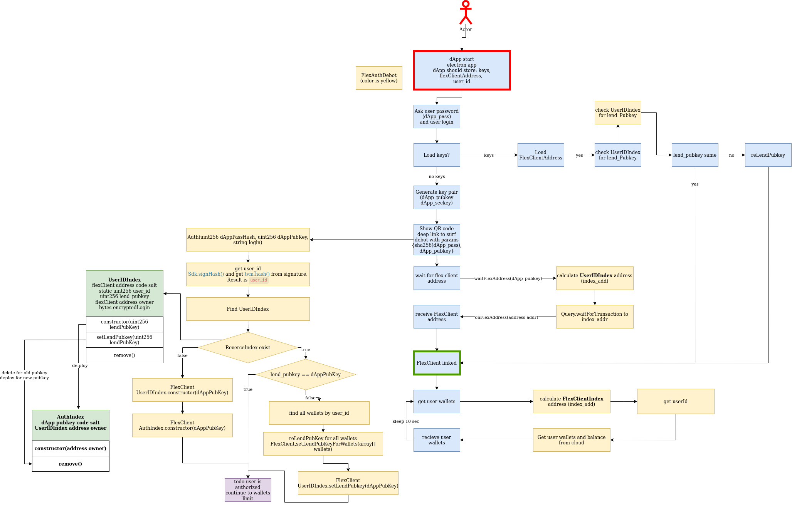
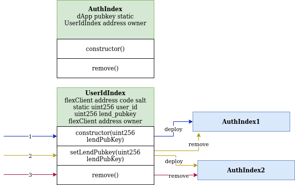

# DApp Authorization

As noted previously, convenience and complex trading use cases may call for a more comprehensive interface, than chat-based DeBots.

Flex thus supports the option to authorize a trading application to work with the user's TIP3 Wallet directly by lending ownership of it to an app the user trusts. This way Flex workflows may be streamlined, where they previously required constant manual confirmation of actions.

The DApp is identified by an external public key that the user has to specify.

The following diagram details authorization procedure.

### UserID Index

There is no way to understand which wallets were created for some FlexClient. So we need UserID Index for it.

This contract contains FlexClient address into code salt and we can find all such contracts for specified FlexClient by code hash. It can be deployed only by FlexClient.

This contract contains data about user:

> `static uint256 user_id` - the user\_id, It is used for address calculation `uint256 lend_pubkey` - public key of dApp. We need this field to realize that dApp\_pubkey changed and we need to change lend\_pubkey into every user\_id’s FlexWalllet. `address owner` - Address that can send message to UserIdIndex. It is address of FlexClient. `bytes name` - encrypted login. We use naclbox for encryption.

💡 **Login encryption**. Use naclbox for encryption. We use key pair of Surf and some random their\_pubkey. We can decrypt it with Surf key pair. Surf flow question: should we enter pin code for every crypt operation?

#### Contract methods

> **constructor** (`lend_pubkey`, `name`) - set msg.sender as owner. Deploy AuthIndex with `lend_pubkey`&#x20;
>
> **reLendPubkey** (`new_lend_pubkey`) - Remove AuthIndex with `lend_pubkey`. Deploy AuthIndex with `new_lend_pubkey`. Set `lend_pubkey` = `new_lend_pubkey`&#x20;
>
> **remove** () - Remove AuthIndex with `lend_pubkey`.

UserIdIndex contract should get message only from owner (FlexClient)

### Auth Index

Auth index is contract that helps dApp find user\_id and FlexClient address by `dApp_pubkey`.

Auth index contains `dApp_pubkey` as static data and UserIDIndex address as data

UserIDIndex contract is the owner of Auth Index

Contract data

> `uint256 static pubkey` - it is `dApp_pubkey` . Address is calculated from this value. `address owner` - is UserIDIndex address that create this contract

Contract methods

> **constructor**() - can be called only by internal message. msg.sender is owner **remove** () - can be called only by owner

**How to find user\_id from dApp\_pubkey.**

We can calculate AuthIndex address if we know dApp\_pubkey. From this address we can obtain owner(address of UserIdIndex). From UserIdIndex we can obtain user\_id and FlexClient address.

#### **FlexClient contains methods for operations on UserIdIndex and AuthIndex**:

> **deployIndex**(`user_id`, `lend_pubkey`, `name`) - deploy UserIdIndex contract **reLendIndex**(`user_id`, `new_lend_pubkey`, `address[] wallets`) - change `lend_pubkey` into UserIdIndex contract(call UserIdIndex.reLendPubkey). set `new_lend_pubkey` for every wallet from `wallets` .&#x20;
>
> &#x20;**destroyIndex**(`user_id`) - remove UserIdIndex contract **getIndexAddress**(`user_id`) - return Reverse Index address.
