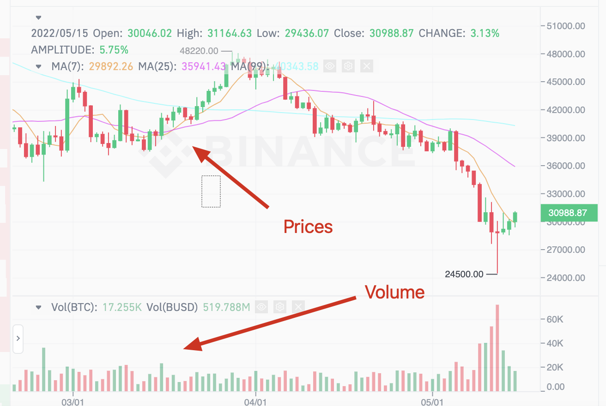

# Flex API

Flex API allows to develop Flex client apps that query Flex contracts directly on the blockchain via the methods described in this document.

## Flex API

[Flex Glossary](glossary.md#flex-api-glossary)

Flex API is GraphQL API that is defined by GraphQL schema, described below.

All the fields descriptions are given in the code snippets.

### Root `flex` query

Here is the Root `flex` query that returns the main `FlexQuery` type.

```graphql
# Query
type Query {
    flex(
      " Default address is the latest Super Root "
      superRoot: String
      """ 
	    Default is `releaseConfig` address of superRoot.
      If superRoot is omitted and globalConfig is specified, then all flex data will be related to globalConfig except FlexQuery root fields related to Super root (releaseConfig, betaConfig, etc)
      """
      globalConfig: address
    ): FlexQuery 
}

type FlexQuery {
	  " Flex release version from Super Root"
		releaseConfig: FlexGlobalConfig 
    " Flex beta version from Super Root"
		betaConfig: FlexGlobalConfig
    " globalConfig specified in the `flex` parameters "
    config: FlexGlobalConfig 
	  " Super Root version "
		revision: Int
		"""
		Flag that indicates that a bug was found in Exchange contracts, you should stop trading and cancel all your orders. Keep funds on your wallets, they are okay.
		"""
    stopTrade: Boolean
		"""
		Flag that indicates that a bug was found that encorages everyone to cancel their orders and withdraw their funds from Flex wallets asap
		"""
		abandonShip: Boolean 
		"""
		True means the beginning of upgrade process which forbids to list/unlist new wrappers and pairs. Flag is reset to false when upgrade process is over. 
		False means the dex is not in the upgrade process and one can list/unlist new wrappers and pairs.
		"""
		updateStarted: Boolean 
		" Get all the listed tokens"  
    tokens(...): [FlexToken] 
		" Get information about one token "
    getToken(...): FlexToken 
		" Get all the listed pairs "
    pairs(...): [FlexPair] 
	  " Get information about one pair "
    getPair(...): FlexPair 
    " Get information about the market "
    market(...): FlexMarket 
		" User wallets "
		wallets(...): [FlexWallet!]!
		userTrades(...): [FlexUserTrade!]!
		userOrders(...): [FlexUserOrder!]!
}
```

### FlexGlobalConfig

For now we store only a structure with each group version and Exchange Config for UI purposes.

Will extend it with User and Wrapper configs in future if it will be needed.

```graphql
type FlexQuery {
		...
		releaseConfig: FlexGlobalConfig
		betaConfig: FlexGlobalConfig
    config: FlexGlobalConfig
		...
}

type FlexGlobalConfig {
		" Global config address "
		address: String 
		" Wallet, Exchange and User versions structure "
    version: FlexVersion
    "  Exchange Group version info "
		exchange: ExchangeConfig
    wrapper: WrapperConfig
	  user: UserConfig
}

type FlexVersion {
    " Version of token wrappers and wallets contracts "
    wallet: Int
    " Version of exchange contracts (flex, pair, price) "  
    exchange: Int
    " Version of user contracts and debots (FlexClient, etc) "
    user: Int
}

type ExchangeConfig{
    " Version of exchange contracts (flex, pair, price) "  	
		version: Int
    fees: FlexFeesConfig
}

type FlexFeesConfig{
	" For executing tip3 transfer "
  transfer_tip3: Int
	"  To return tip3 ownership "
  return_ownership: Int
	" To send answer message from PriceXchg "
  order_answer: Int
	""" 
	To process processQueue function 
	Also is used for buyTip3 / onTip3LendOwnership / cancelSell / cancelBuy estimations.
	"""
  process_queue: Int
  " To send notification about completed deals (IFlexNotify) "
  send_notify: Int;
  """ 
	Amount of EVERs transfered to the recipient tip3 wallet during all token transfers. Needed to support wallet auto-deploy, so that the deployed wallet has enough funds to procees. Auto-deploy happens when tokens are transfered to a not existing wallet.
  """
  dest_wallet_keep_evers: Int
}

```

### tokens

This method returns all tokens, listed on Flex.

```graphql
type FlexQuery {
		tokens(
			" To find tokens by Ticker subscring "
      tickerSubstringFilter: String
			" Pagination parameters "
      limit: Int
      offset: Int
): FlexToken
}
type FlexToken {
    " Wrapper address "
    address: String
    " Full name "
    name: String
    " Token ticker, i.e. 'EVER' "
    ticker: String
    " defines the number of decimal places "
    decimals: Int
    " total_granted in tokens "
    totalAllocated: String
    " in contract - total_granted field in units "
    totalAllocatedUnits: String
    " flex tip3 wallet code hash "
    walletCodeHash: String
	****	" Original token type identifyer. 1 - EVER token wrapper "
****		wrapperType: Int 
**~~~~**
    """ 
		Account that locks and stores all external tokens
	  for WEVER wrapper type - empty
		"""
    externalAddress: String
}
```

Token information is stored in so-called wrapper contracts, that wrap ever/tip3.2/potentially other tokens and act as a root contract that deploys Flex wallets for those wrapped tokens.

### getToken

Query that returns info of a particular token by its wrapper address or token symbol string.

```graphql
type Flex(root: address) {
	getToken(?ticker: string, ?address: string): TToken,
}
```

### pairs

This query retrieves listed trading pairs on Flex.

```graphql
type Flex {
    pairs(
        tickerSubstringFilter: String,
        limit: Int,
        offset: Int
    ): [FlexPair]
}

type FlexPair {
    " Flex Pair account address "
    address: String
    """
    Abbrevation used to identify pair.
    Derived from major and minor root tickers, i.e. 'EVER/SOL'
    """
    ticker: String
    " Major token of the pair "
    major: FlexToken
    " Minor token of the pair "
    minor: FlexToken
		"""
    Min amount of major token required for an order creation in token units.
    """
    minAmount: String
		" minAmount in major token units "
    minAmountUnits: String
    " Code hash of price contracts for the pair "
    priceCodeHash: String
    " Notification contract address. Receives notification for each executed trade "
    notifyAddress: String
		" Token price denominator. Format: 10eN where N - number of digits after the decimal point "
		priceScale: number,
		" Unit price denominator "
		priceScale_units: number,
		" Price tick size numerator "
		min_move: number,
		" Code hash of price contract "
****    priceCodeHash: string,
		" Code of price contract "
		priceCode: string
}
```

### getPair

Query that returns info of a particular Symbol (pair) by its Trading Pair contract address or Pair Symbol string.

```graphql
type FlexQuery {
	    getPair(
        pairTicker: String
        pairAddress: String
    ): FlexPair
}
```

### Market

Market - all the data, relevant for 1 Trading Pair.

All queries inside a Market return data filtered by the relevant `pairTicker` or `pairAddress`.

```graphql
type FlexQuery
{
market(
	pairTicker: String
	pairAddress: String
): FlexMarketQuery
		
type FlexMarketQuery
{
	pair: FlexPair
	recentTrades(...): [FlexTrade!]!
	priceHistoryResolutions: [Int!]!
	priceHistory(...): FlexPriceHistory!
	orderBook(...): FlexOrderBook!
	last24H: FlexPriceSummary!
	price: String
	}
}
```

#### recentTrades

Returns 50 trades of the market .

```graphql
type FlexMarketQuery{
	recentTrades(
    " Limit the number of returned trades but no more than 50 "
    limit: Int
	): [FlexTrade!]!
}

type FlexTrade {
    " Taker's side in the trade "
    side: FlexTradeSide
    time: Int
    sellToken: FlexToken
    buyToken: FlexToken
    " Major tokens amount "
    amount: String
		" Major units amount "
    amountUnits: String
    " Price of the major token in tokens "
    price: String
		" Price numenator "
    priceNum: String
    " Token price denomenator  "
    priceScale: String
    " Unit price denomenator "
    priceScaleUnits: String
    " Cursor for pagination "
}

enum FlexTradeSide {
	BUY
	SELL
}
```

#### priceHistory

Price and volume history is needed by trading applications to draw so-called bars or candles displaying price history of a trading pair.

<figure><figcaption></figcaption></figure>

```graphql
type FlexMarketQuery{
	" Supported time resolutions"
	priceHistoryResolutions: [Int!]!
	priceHistory(
	  " Time resolution in seconds"
		resolution: Int
		" Inclusive "
		startTime: Int
	  " Exclusive "
		endTime: Int
    """ 
		This field defines minimum number of returned bars,
    and has priority over startTime parameter,
    i.e. you must return data in the range `[from, to)`,
    but the number of bars should not be less than 
    `countBack`
		"""
		countBack: Int
	): FlexPriceHistory!
}

type FlexPriceHistory {
    " Price information for the resolution time range "
    prices: [FlexPriceSummary]
    """
		Returns next available time before the requested time range. Returns null if there is no more prices.
    """
    nextTime: Int
}

type FlexPriceSummary {
    " Start time of resolution time range. Range end time is time + resolution "
    time: Int
    " The first price in range (opening price) "
    open: String
    " The last price in range (closing price) "
    close: String
    " Minimal price in range "
    low: String
    " Maximal price in range "
    high: String
    " Total amount of all trades in range "
    volume: String
}
```

This data is collected from trades. Each dot on the graph should have such data as open, close, highest and lowest price and volume for each period starting from `start_time`. Period length is defined by `resolution` parameter.

We do not show `getEmptyBars` parameter and assume it as false. We do not return empty bars.

&#x20;📚 Example 1: let's say the chart requests 300 bars with the range `[2019-06-01T00:00:00..2020-01-01T00:00:00]` in the request. If you have only 250 bars in the requested period (`[2019-06-01T00:00:00..2020-01-01T00:00:00]`) and you return these 250 bars, the chart will make another request to load 50 more bars preceding `2019-06-01T00:00:00` date.

Example 2: let's say the chart requests 300 bars with the range `[2019-06-01T00:00:00..2020-01-01T00:00:00]` in the request. If you don't have bars in the requested period, you don't need to return `noData: true` with the `nextTime` parameter equal to the next available data. You can simply return 300 bars prior to `2020-01-01T00:00:00` even if this data is before the `from` date.

#### orderbook

Orderbook is a list of available Trading Pair liquidity for buying and selling aggregated by price.

Return top 50 bids and asks.

bids are sorted by price DESC

asks are sorted by price DESC

```graphql
type Market {
    orderbook(limit: Int): FlexOrderBook
}

type FlexOrderBook {
    " Liquidity for buying "
		bids: [FlexOrderbookItem]
    " Liquidity for selling "
		asks: [FlexOrderbookItem]
	}

type FlexOrderbookItem {
    """ 
    Price of 1 major token denominated in minor token with precision of Pair's pricescale
    """
		price : String
    " Token price numerator "
		priceNum: String
    " Token price denomerator "
		priceScale: String
    " Unit price denomerator "
		priceScaleUnits: String
    " Amount of major tokens "
		amount: String
		" Amount of major units "
		amountUnits: String
}
```

#### Statistics

```graphql
type Market {
    " Latest trade's price "
    price: String
    " Price and volume stats for the last 24 hours "
    last24H: FlexPriceSummary
}

type FlexPriceSummary {
	time: Int
	open: String
	close: String
	low: String
	high: String
	volume: String
}

```

### Trader data

[Trader data glossary](glossary.md#trader-data-glossary)

#### wallets

```graphql
type Flex(root: address) {
	wallets(
		" Flex Client contract address "
		clientAddress: String!
    " Wallet token "
		token: FlexToken
    " User ID "
		userId: String
    " DApp public key "
		dappPubkey: String
    " After cursor field "
		after: String
		limit: Int
	): [FlexWallet!]!
} 

type FlexWallet {
    " Flex wallet address
    address: String
    " Flex Client contract address
    clientAddress: String
    " userId of the Trader "
    userId: String
    " DApp pubkey "
    dappPubkey: String 
    " Token information"
    token: FlexToken
    " balance of native currency of the wallet (in evers) "
    nativeCurrencyBalance: String
    " balance of native currency of the wallet (in nanoevers) "
    nativeCurrencyBalanceUnits: String
    " Tokens balance of the wallet in tokens "
    totalBalance: String
    " Total balance of the wallet in units "
    totalBalanceUnits: String
    " Balance in tokens reduced by amount in orders "
    availableBalance: String
    " Balance in units reduced by amount in orders "
    availableBalanceUnits: String
    " Balance in tokens placed into orders "
    balanceInOrders: String
    " Balance in units placed into orders "
		balanceInOrdersUnits: String
    " Tokens lend finish time  "
    lendFinishTime: Int
    # Cursor that can be used for pagination
    cursor: String
}
```

Wrapper contract stores user wallet code.

Flex wallets are deployed by Flex Client contract which becomes their owner. Therefore, we need to use flex client addresses to search for all the client’s wallets.

#### userOrders

Shows all User’s open and expired orders.

Sort by price ASC, order\_id. Returns top 50 records.

```graphql
type FlexQuery {
    userOrders(
			userId: String
      after: String
		  limit: Int
		  offset: Int
		): [FlexUserOrder]
}

type FlexUserOrder {
    pair: FlexPair
    side: FlexTradeSide
    " Order amount in tokens left "
	  amountLeft: String
    " Order amount in units left"
	  amountLeftUnits: String
    " Order amount in tokens that has been processed "
	  amountProcessed: String
    " Order amount in units that has been processed "
    amountProcessedUnits: String
		" Order price in tokens"
    price: String
    " Price numerator "
    priceNum: String
    " Token price denomerator "
    priceScale: String
    " Unit price denomerator "
    priceScaleUnits: String
    "  User ID of the DApp "
    ****userId: String
		" Optional. Order ID. "
    orderId: String
		" Order finish (expiration) time "
    finishTime: Int
****}
```

#### userTrades

User trades list returns all user trades history on all markets.

```graphql
type FlexQuery {
    userTrades(
			userId: String!
			after: String
			limit: Int
			offset: Int
		): [FlexUserTrade!]!
}

type FlexUserTrade {
    pair: FlexPair
    side: FlexTradeSide
		" Major tokens amount"
    amount: String
		" Major tokens amount in units"
    amountUnits: String
		" Order price in tokens"
    price: String
    " Price numerator "
    priceNum: String
    " Token price denomerator "
    priceScale: String
    " Unit price denomerator "
    priceScaleUnits: String
    time: Int
		" User position in the trade "
    liquidity: FlexTradeLiquidity
		"""
		User fees for this trade. Measured in major tokens.
		
		If the user is a maker then fees is a value received by user as a bonus for making order. Note that in this case the fees is a negative value.
		
		If the user is a taker then fees is a value that the user pays to the exchange and maker.
		"""
    fees: String
    feesUnits: String
    cursor: String
}

"""
Determines the users position in trade. Maker or taker. Maker is a trade counterparty whose order was earlier. Taker is a counterparty with a later order.
"""
enum FlexTradeLiquidity {
    TAKER
    MAKER
}
```

### Subscriptions

#### Orderbook, recentTrades, priceHistory

```graphql
input MarketPair {
    ticker: String
    address: String
}

subscription {
    """
    Returns market orderbook and after that whenever there is a change 
    to orderbook, sends the updated Orderbook.
    """
    flexMarketOrderBook(
        flex: String,
        pairAddress: String,
        pairTicker: String
    ): FlexOrderBook

    """
    Starts sending new trades 
    created after trade specified by after_id.
    """
    flexMarketRecentTrades(
        flex: String,
        pairAddress: String,
        pairTicker: String
				after: string
    ): FlexTrade[]

    """
		Returns an array of price summary objects strting from
		start_time aggregated by resolution and then 
		starts sending price summary object whenever there is a new trade
		for the last time range defined by resolution.
		Timerange is changing over time. If resolution is 1 minute, then, when 
    the minute passes, a new timerange is started and new priceSummary object is returned.
    """
    flexMarketPriceHistory(
        flex: String, 
        pair_address: String,
        pair_ticker: String,
				start_time: uint,
        resolution: Int
    ): FlexPriceSummary[]
}
```

#### userOrders, userTrades, wallets

```jsx
subscription {
    """
    Returns market orderbook and after that whenever there is a change 
    to orderbook, sends the updated Orderbook.
    """
    flexUserOrders(
        flexAddress: String,
        userId: String
    ): FlexUserOrder[]

    """
    Starts sending new trades 
    created after trade specified by after cursor.
    """
    flexUserTrades(
        flexAddress: String,
        userId: String,
				after: String
    ): FlexTrade[]

    """
		Returns list of client wallets then starts sending 
    new wallet creations and existing wallet updates.
		Wallet deletions are not included in event types.
		if after is not specified, starts sending only 
		latest updates since subscription creation
    """
    flexWallets(
        flex: String,
        clientAddress: String!,
        userId: String,
				dappPubkey: String,
        after: String # after cursor
    ): FlexWallet[]
}
```

### Coming soon:

#### Order status subscription

```graphql
subscription {
    """
			Sends order status updates for user orders. Contains informarion about order status and processed/unprocessed amount, and order info about trading pair, side and price in tokens and nanotokens.
			Please, note that in case of CANCEL and CLOSED statused order may be partially executed. 
    """
    flexUserOrderUpdates(
        userId: String
    ): FlexUserOrderUpdate[]

type FlexUserOrderUpdate {
		orderId: string
		timestamp: uint
		status: enum {CANCELED, EXECUTED, CREATED, CREATION_FAILED, CLOSED}, 
		"""
	From here: [<https://github.com/tonlabs/ton-contracts/blob/21d08e8f85c122693e6f0bbc22f23c467c8e3920/cpp/freetrade/exchange/xchg/error_code.hpp#L13>](<https://github.com/tonlabs/ton-contracts/blob/21d08e8f85c122693e6f0bbc22f23c467c8e3920/cpp/freetrade/exchange/xchg/error_code.hpp#L13>)
		"""
		error_code: enum {out_of_tons, deals_limit, etc} 
		majorToken: FlexToken, 
		minorToken: FlexToken,
		amountEnqueued: String # enqueued/major_decimals
		amountEnqueuedUnits: String # enqueued
		amountProcessed: String # processed/major_decimals
		amountProcessedUnits: String # processed
		price: String # price_num/priceScale
		priceNum: String #price_num
		priceScale: String # price_denum * 10^(minor_decimals - major_decimals)
		priceScaleUnits: String # price_denum 
		side: enum {BUY, SELL} 
		userId: string
}

```

#### Flex statistics

```graphql
type Flex(root: address) {
		statistics: TMarketStats {
			TVL: uint # total value locked in Flex denominated in USD
			volume: uint # 24 hour volume on the Flex for all markets.		
		}
}
```

#### userEquity (not implemented yet)

Equity - total balance of all tokens converted to EVER or USD currency price

```graphql
type userEquity(pubkey: string): TUserData {
		equity: uint  # 
	}
```
